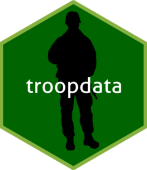

<!-- README.md is generated from README.Rmd. Please edit that file -->

# `troopdata`: Tools for Analyzing Cross-National Military Deployment and Basing Data

<!-- badges: start -->

[](https://cran.r-project.org/package=troopdata)
[](https://github.com/meflynn/troopdata)
[](https://cran.r-project.org/package=troopdata)
[](https://cran.r-project.org/package=troopdata)
[](https://cran.r-project.org/package=troopdata)
<!-- badges: end -->



The goal of the `{troopdata}` package is to facilitate the distribution
of military deployment and basing data for use in social science
research and journalism. The troop deployment data were initially
compiled by Tim Kane using information obtained from the U.S. Department
of Defense’s Defense Manpower Data Center (DMDC). The original data
ended in 2005 and we have updated it to run through 2024.

Similarly, the basing data were initially compiled by David Vine, and we
have updated the original data using open source information from the
U.S. military and press reports through 2018. We have also assembled
this R package to allow users to more easily access the data and use it
in their own research.

The package will be updated with additional features in the future, but
for now please let me know if you find any errors.

Please refer to the bottom of this page for citation information.

You can also find more information on the package and changes
corresponding to each update here:
<https://meflynn.github.io/troopdata/index.html>

## Installation

You can install the `troopdata` package from CRAN or
[GitHub](https://github.com/) with:

``` r
#install.packages("devtools")

install.packages("troopdata")

or 

devtools::install_github("meflynn/troopdata")
```

## Use

This package currently has two functions:

`get_troopdata()`: Returns a data frame containing U.S. military
deployment values. Depending on the arguments specified the function
returns total troop deployments, or total deployments plus service
branch-specific deployment values, guard and reserve values, and DoD
civilian values. Users can specify select countries and years, or call
the entire data frame.

`get_basedata()`: Returns a data frame containing information on U.S.
military bases around the globe from the Cold War forward. Depending on
the arguments specified the function will return the entire data set or
data for a particular country. Observations can be site-specific or can
be aggregated to generate country counts.

`get_builddata()`: Returns a data frame containing geocoded
location-year information on U.S. military overseas construction
spending. Users can specify select countries and years, or call the
entire data frame. Currently only select countries are included in the
data

## Examples

You can find more detailed vignettes on these functions below:

1.  [`get_troopdata`](https://meflynn.github.io/troopdata/articles/troopdata-vignette.html)
2.  [`get_basedata`](https://meflynn.github.io/troopdata/articles/basedata-vignette.html)
3.  [`get_builddata`](https://meflynn.github.io/troopdata/articles/builddata-vignette.html)

## A note on country codes

The original DMDC data contain information on U.S. troop deployments to
a a wide range of locations, including several non-state territories and
subnational units (e.g. Okinawa). One downside of using the COW country
codes as the primary host ID variable is that there are often no country
codes for smaller states and territories. In the case of the Vine basing
data, some smaller territories have COW codes for the imperial power
that controls a territory. For example, Puerto Rico and Guam both
receive a COW country code of 2 as they are territorial possessions of
the United States. Users may want to distinguish such cases where
deployments are present in a territory versus the metropole. Using the
ISO country codes provides some additional flexibility when calling the
data. Worst case, you can pull the full data frame and look around at
the specific observations and figure out what best suits your needs.

## How to cite this package and data?

When using the updated troop deployment data and/or the `troopdata`
package please cite the following:

- Michael A. Allen, Michael E. Flynn, and Carla Martinez Machain. 2022.
  “Global U.S. military deployment data: 1950-2020.” Conflict Management
  and Peace Science. 39(3): 351-370.

Kane’s original troop deployment data collected from 1950-2005:

- Kane, Tim. 2005. “Global U.S. troop deployment, 1950-2003.” Technical
  Report. Heritage Foundation, Washington, D.C.

Vine’s original basing data:

- Vine, David. 2015. “Base nation: How U.S. military bases abroad harm
  America and the World.” Metropolitan Books, Washington, D.C.

Construction data

- Michael A. Allen, Michael E. Flynn, and Carla Martinez Machain. 2020.
  “Outside the wire: US military deployments and public opinion in host
  states.” American Political Science Review. 114(2): 326-341.
