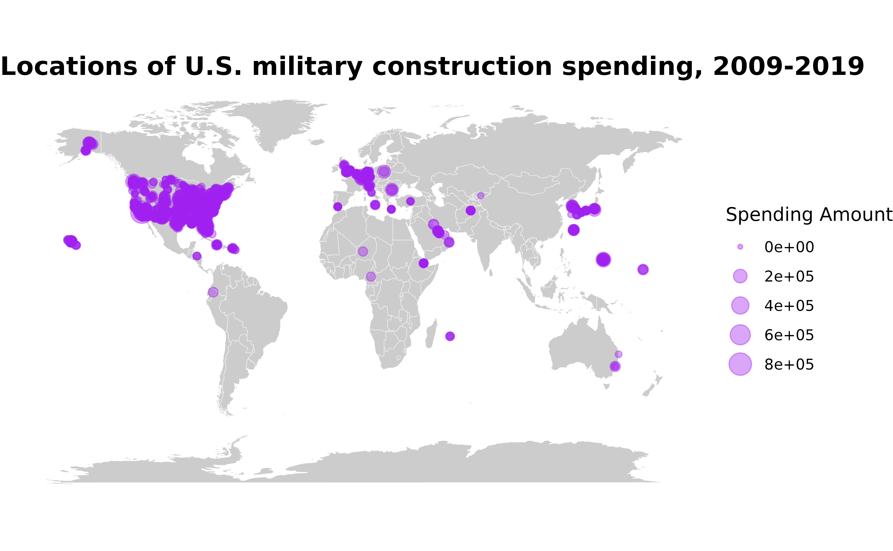

# get_builddata

This page provides an overview for the
[`get_basedata()`](https://meflynn.github.io/troopdata/reference/get_basedata.md)
function, highlighting some of its potential uses.

First things first—let’s load the
[troopdata](https://github.com/meflynn/troopdata) package

``` r
library(troopdata)
library(ggplot2)
```

The troopdata package provides multiple functions to generate
customizable datasets containing information on US military deployments
and accompanying data. The
[`get_basedata()`](https://meflynn.github.io/troopdata/reference/get_basedata.md)
function represents the core of this package, providing customized data
on US overseas troop deployments, specifically.

## Basic Use

Users can call on the
[`get_builddata()`](https://meflynn.github.io/troopdata/reference/get_builddata.md)
returns a data frame containing geocoded location-project-year military
construction data. The basic arguments function the same as compared to
the previous functions. The primary difference is that the data are
currently available only for all countries and years where the
Department of Defense publicly discloses spending figures from 2008
through 2019. Note there are also many observations included that
contain amounts, but do not disclose location names or other
information.

``` r

hostlist <- c(200, 255, 211)

buildexample <- get_builddata(host = hostlist, startyear = 2008, endyear = 2019)
#> Warning: Be advised that the data include unspecified locations, as well as 0
#> or negative spending values.
#> Warning: Spending values are in thousands of current US dollars.

head(buildexample)
#> # A tibble: 6 × 8
#>   countryname    ccode iso3c  year location        lat    lon spend_construction
#>   <chr>          <dbl> <chr> <dbl> <chr>         <dbl>  <dbl>              <dbl>
#> 1 United Kingdom   200 GBR    2008 Royal Air Fo…  52.4  0.518               1800
#> 2 United Kingdom   200 GBR    2008 Royal Air Fo…  52.4  0.518              15500
#> 3 United Kingdom   200 GBR    2008 Menwith Hill…  54.8 -2.70               10000
#> 4 United Kingdom   200 GBR    2008 Menwith Hill…  54.8 -2.70               31000
#> 5 United Kingdom   200 GBR    2009 Royal Air Fo…  52.4  0.518              71828
#> 6 United Kingdom   200 GBR    2009 Royal Air Fo…  52.4  0.518               7400
```

As with the base data you can build cool maps using the construction
data. You can also size the points according to the amount of spending
associated with a particular location, adding some additional details to
maps and other figures.

``` r

library(ggplot2)

map <- ggplot2::map_data("world")
basepoints <- troopdata::get_builddata(host = NA, startyear = 2009, endyear = 2019)


buildmap <- ggplot() +
  geom_polygon(data = map, aes(x = long, y = lat, group = group), fill = "gray80", color = "white", size = 0.1) +
  geom_point(data = basepoints, aes(x = lon, y = lat, size = spend_construction), color = "purple", alpha = 0.4) +
  coord_equal(ratio = 1.3) +
  theme_void() +
  theme(plot.title = element_text(face = "bold", size = 15)) +
  labs(title = "Locations of U.S. military construction spending, 2009-2019",
       size = "Spending Amount")


buildmap
```


