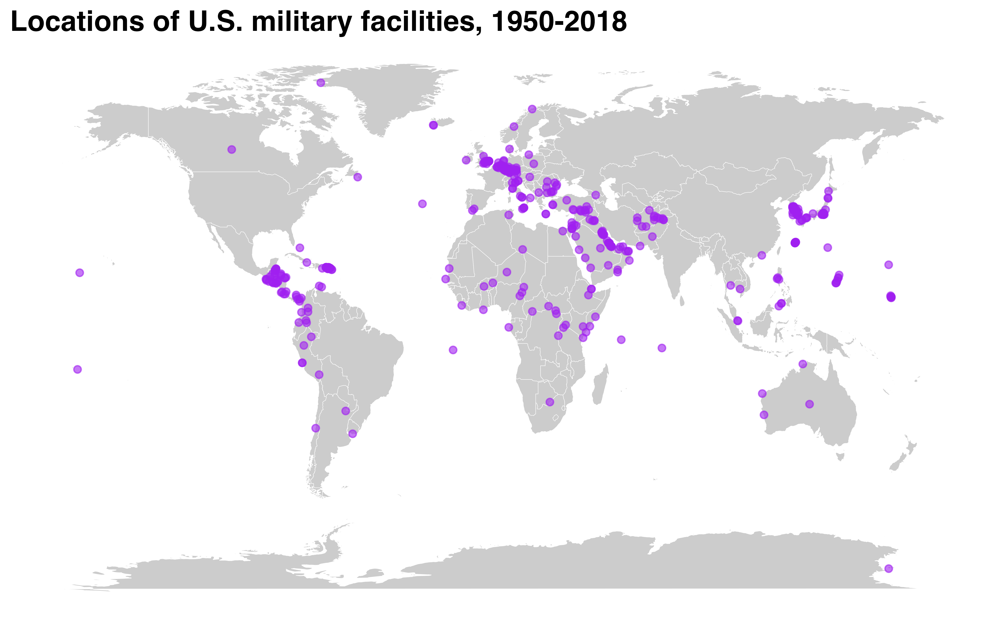

# get_basedata

This page provides an overview for the
[`get_basedata()`](https://meflynn.github.io/troopdata/reference/get_basedata.md)
function, highlighting some of its potential uses.

First things first—let’s load the
[troopdata](https://github.com/meflynn/troopdata) package

``` r
library(troopdata)
library(ggplot2)
#> Warning: package 'ggplot2' was built under R version 4.4.3
library(dplyr)
#> Warning: package 'dplyr' was built under R version 4.4.3
#> 
#> Attaching package: 'dplyr'
#> The following objects are masked from 'package:stats':
#> 
#>     filter, lag
#> The following objects are masked from 'package:base':
#> 
#>     intersect, setdiff, setequal, union
```

The troopdata package provides multiple functions to generate
customizable datasets containing information on US military deployments
and accompanying data. The
[`get_basedata()`](https://meflynn.github.io/troopdata/reference/get_basedata.md)
function represents the core of this package, providing customized data
on US overseas troop deployments, specifically.

## Basic Use

The second function,
[`get_basedata()`](https://meflynn.github.io/troopdata/reference/get_basedata.md)
returns a data frame containing information on the United States’
overseas military bases going back to the beginning of the Cold War. At
its most basic the function will return a data frame containing
country-base observations, along with the facility’s longitude and
latitude (if available), and a series of binary variables indicating
whether or not the facility is a full military base, a smaller lilypad,
and if it is a currently funded site.

``` r

baseexample <- get_basedata(host = NA, country_count = FALSE)

head(baseexample)
#> # A tibble: 6 × 9
#>   countryname ccode iso3c basename            lat   lon  base lilypad fundedsite
#>   <chr>       <dbl> <chr> <chr>             <dbl> <dbl> <dbl>   <dbl>      <dbl>
#> 1 Afghanistan   700 AFG   Bagram AB          34.9  69.3     1       0          0
#> 2 Afghanistan   700 AFG   Kandahar Airfield  31.5  65.8     1       0          0
#> 3 Afghanistan   700 AFG   Mazar-e-Sharif     36.7  67.2     1       0          0
#> 4 Afghanistan   700 AFG   Gardez             33.6  69.2     1       0          0
#> 5 Afghanistan   700 AFG   Kabul              34.5  69.2     1       0          0
#> 6 Afghanistan   700 AFG   Herat              34.3  62.2     1       0          0
```

As with the
[`get_troopdata()`](https://meflynn.github.io/troopdata/reference/get_troopdata.md)
function you can specify a numeric vector of COW country codes or a
character vector of ISO3C codes to specify specific host countries.

For example, using COW country codes:

``` r

hostlist <- c(20, 200, 255, 645)

baseexample <- get_basedata(host = hostlist, country_count = FALSE)

head(baseexample)
#> # A tibble: 6 × 9
#>   countryname         ccode iso3c basename   lat    lon  base lilypad fundedsite
#>   <chr>               <dbl> <chr> <chr>    <dbl>  <dbl> <dbl>   <dbl>      <dbl>
#> 1 Ascension Island      200 GBR   Ascensi… -7.95  -14.4     1       0          0
#> 2 BR Indian Ocean Te…   200 GBR   Diego G… -7.32   72.4     1       0          0
#> 3 Canada                 20 CAN   NA       56.1  -106.      0       1          0
#> 4 Canada                 20 CAN   Argenti… 47.3   -54.0     1       0          0
#> 5 Germany               255 DEU   Amberg   49.4    11.9     1       0          0
#> 6 Germany               255 DEU   USAG An… 49.3    10.6     1       0          0
```

And another using ISO3C codes:

``` r

hostlist.char <- c("CAN", "GBR", "PRI")

baseexample <- get_basedata(host = hostlist.char, country_count = FALSE)
```

Finally, users can also generate country-level counts of the number of
U.S. military bases by changing the `country_count` argument to `TRUE`.
Note that when using this argument you also need to specify the
`groupvar` argument, which specifies which identifier will be used to
generate country-level totals. Though this may sound obvious individual
country codes may include multiple geographic territories that are more
finely parsed using various identifiers. Accepted character strings
include “countryname”, “iso3c”, and “ccode”. And while this may seem
redundant given the host argument, it should provide flexibility for
users who may be more familiar with country codes and do not want to
spend time trying to identify long-form country names.

``` r

hostlist <- c(20, 200, 255, 645)

baseexample <- get_basedata(host = hostlist, country_count = TRUE, groupvar = "ccode")
#> Warning: Must specify grouping variable when using country_count.
#> Warning: group var must equal 'countryname', 'ccode', or 'iso3c'.

head(baseexample)
#> # A tibble: 4 × 4
#>   ccode basecount lilypadcount fundedsitecount
#>   <dbl>     <dbl>        <dbl>           <dbl>
#> 1    20         1            1               0
#> 2   200        18            0               0
#> 3   255        40            4               0
#> 4   645         2            2               0
```

## Applications

So what can you do with these super useful and cool data? Lots of
things! The study of basing and military deployments has been picking up
over the last few years and there are lots of cool studies you should
check out. With these data you can do cool things like this!

``` r

library(ggplot2)

map <- ggplot2::map_data("world")
basepoints <- get_basedata(host = NA)


basemap <- ggplot() +
  geom_polygon(data = map, aes(x = long, y = lat, group = group), fill = "gray80", color = "white", size = 0.1) +
  geom_point(data = basepoints, aes(x = lon, y = lat), color = "purple", alpha = 0.6) +
  coord_equal(ratio = 1.3) +
  theme_void() +
  theme(plot.title = element_text(face = "bold", size = 15)) +
  labs(title = "Locations of U.S. military facilities, 1950-2018")


basemap
```


