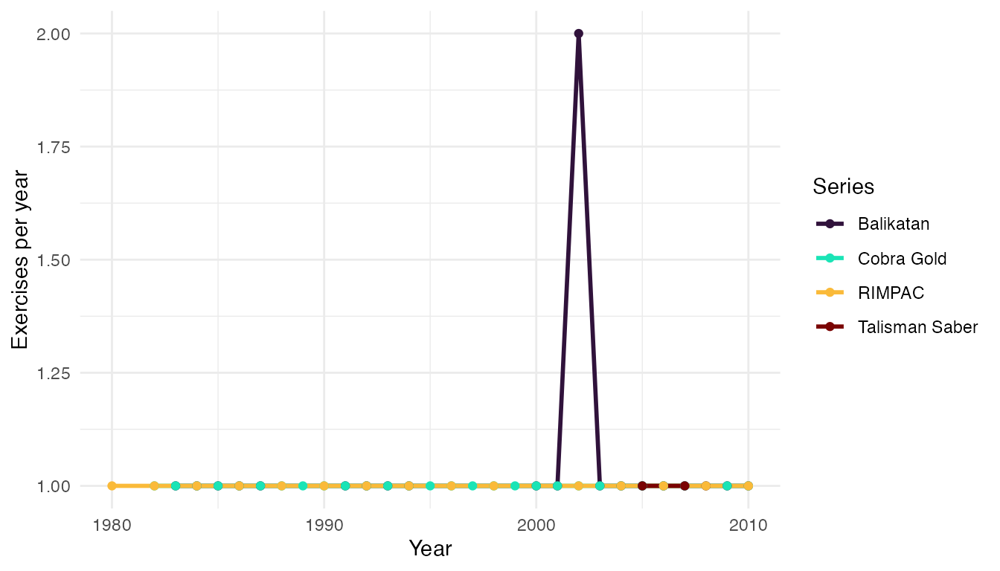

# get_exercises

This page provides an overview for the
[`get_exercises()`](https://meflynn.github.io/troopdata/reference/get_exercises.md)
function, the latest addition to the
[troopdata](https://github.com/meflynn/troopdata) package. The function
returns a customized data frame of exercise-country-year observations
drawn from the Multinational Military Exercises (MME) dataset (D’Orazio
and Galambos 2021), reshaped into long format so each row represents a
single participating country in a single year of a single exercise.

First things first—let’s load the
[troopdata](https://github.com/meflynn/troopdata) package along with a
few helpers we’ll use for plotting and wrangling.

``` r
library(troopdata)
library(dplyr)
library(tidyverse)
library(ggplot2)
library(viridis)
```

The underlying data object is `mme_long`, and
[`get_exercises()`](https://meflynn.github.io/troopdata/reference/get_exercises.md)
exposes a series of filter arguments that let users subset the data by
participating country, year, exercise duration, geographic location,
exercise name, the domain of the exercise (e.g., air, land, sea), the
mission focus (warfighting, humanitarian, peacekeeping), and the number
of participating countries.

## Basic usage

Called with no arguments,
[`get_exercises()`](https://meflynn.github.io/troopdata/reference/get_exercises.md)
returns the full long-format exercise-country-year dataset across the
entire temporal coverage of the underlying MME data.

``` r

example <- get_exercises()

head(example)
#> # A tibble: 6 × 30
#>   MMEID  Ex_Name Series_Name gwcode country  year Location   lat   lon StartDate
#>   <chr>  <chr>   <chr>        <dbl> <chr>   <dbl> <chr>    <dbl> <dbl> <chr>    
#> 1 mme100 Deterr… Deterrent …     20 Canada   1980 central…  34.6  18.0 5/16/80  
#> 2 mme100 Deterr… Deterrent …    260 Federa…  1980 central…  34.6  18.0 5/16/80  
#> 3 mme100 Deterr… Deterrent …    325 Italy    1980 central…  34.6  18.0 5/16/80  
#> 4 mme100 Deterr… Deterrent …    210 Nether…  1980 central…  34.6  18.0 5/16/80  
#> 5 mme100 Deterr… Deterrent …    640 Turkey   1980 central…  34.6  18.0 5/16/80  
#> 6 mme100 Deterr… Deterrent …    200 United…  1980 central…  34.6  18.0 5/16/80  
#> # ℹ 20 more variables: s.year <dbl>, s.month <dbl>, s.day <chr>, EndDate <chr>,
#> #   e.year <dbl>, e.month <dbl>, e.day <chr>, CPX <dbl>, Air <dbl>, Land <dbl>,
#> #   Sea <dbl>, Amphibious <dbl>, Cyber <dbl>, Warfighting <dbl>,
#> #   Peacekeeping <dbl>, Humanitarian <dbl>, FocusDescription <chr>,
#> #   AdditionalParticipantInfo <chr>, participant_count <int>, duration <dbl>
```

Each row identifies a single participating country in a single year of a
single exercise. The `MMEID` column uniquely identifies each exercise,
`Ex_Name` gives the name of the individual exercise, and `Series_Name`
identifies the broader series the exercise belongs to (e.g., “Cobra Gold
23” is part of the “Cobra Gold” series).

## Filtering by country

The `country` argument accepts either a numeric vector of Gleditsch and
Ward (G&W) country codes or a character vector of country names. Numeric
input is matched exactly against the `gwcode` column; character input is
matched against the `country` column using a case-insensitive `grepl`
fuzzy match, so partial names are accepted.

For example, using a numeric vector of G&W codes:

``` r

# Pull exercises that include Japan (740) and Australia (900)
example.gw <- get_exercises(country = c(740, 900))

head(example.gw)
#> # A tibble: 6 × 30
#>   MMEID Ex_Name Series_Name gwcode country  year Location    lat   lon StartDate
#>   <chr> <chr>   <chr>        <dbl> <chr>   <dbl> <chr>     <dbl> <dbl> <chr>    
#> 1 mme1… RIMPAC… RIMPAC         900 Austra…  1992 Pacific…  35.0  -116. 6/19/92  
#> 2 mme1… RIMPAC… RIMPAC         740 Japan    1992 Pacific…  35.0  -116. 6/19/92  
#> 3 mme1… Major … Major Adex     900 Austra…  1992 malaysi…   4.21  102. 9/22/92  
#> 4 mme1… Starfi… Starfish       900 Austra…  1992 South C…   2.79  104. 9/7/92   
#> 5 mme1… Aces N… NA             900 Austra…  1992 Austral… -12.4   131. 10/19/92 
#> 6 mme1… Suman … Suman Warr…    900 Austra…  1992 Burnham… -43.6   172. 10/19/92 
#> # ℹ 20 more variables: s.year <dbl>, s.month <dbl>, s.day <chr>, EndDate <chr>,
#> #   e.year <dbl>, e.month <dbl>, e.day <chr>, CPX <dbl>, Air <dbl>, Land <dbl>,
#> #   Sea <dbl>, Amphibious <dbl>, Cyber <dbl>, Warfighting <dbl>,
#> #   Peacekeeping <dbl>, Humanitarian <dbl>, FocusDescription <chr>,
#> #   AdditionalParticipantInfo <chr>, participant_count <int>, duration <dbl>
```

Or a character vector. Because the country filter is a fuzzy match, the
string `"korea"` will return participation rows for both North and South
Korea:

``` r

example.korea <- get_exercises(country = "korea")

unique(example.korea$country)
#> [1] "South Korea" "North Korea"
```

This is intentional — users who need to distinguish between
similarly-named countries should either pass the exact G&W code or
post-filter the returned data frame.

## Filtering by year

The `startyear` and `endyear` arguments subset the data to a specific
temporal range. If a year falls outside the available range of the
underlying MME data, the function issues a warning and clamps the value
to the nearest available year rather than failing.

``` r

example.years <- get_exercises(country = "korea",
                               startyear = 2000,
                               endyear = 2010)

head(example.years)
#> # A tibble: 6 × 30
#>   MMEID  Ex_Name Series_Name gwcode country  year Location   lat   lon StartDate
#>   <chr>  <chr>   <chr>        <dbl> <chr>   <dbl> <chr>    <dbl> <dbl> <chr>    
#> 1 mme18… -9      NA             732 South …  2000 Kyonggi…  37.4  128. 2000-02-…
#> 2 mme18… -9      NA             732 South …  2000 Sea of …  38.8  135  2000-04-…
#> 3 mme18… RSOI 2… RSOI           732 South …  2000 South K…  35.9  128. 2000-04-…
#> 4 mme19… Ulchi … UFL            732 South …  2000 South K…  35.9  128. 8/21/00  
#> 5 mme19… Foal E… FE             732 South …  2000 South K…  35.9  128. 10/25/00 
#> 6 mme19… Pacifi… Pacific Re…    732 South …  2000 South C…  15.5  114. 10/2/00  
#> # ℹ 20 more variables: s.year <dbl>, s.month <dbl>, s.day <chr>, EndDate <chr>,
#> #   e.year <dbl>, e.month <dbl>, e.day <chr>, CPX <dbl>, Air <dbl>, Land <dbl>,
#> #   Sea <dbl>, Amphibious <dbl>, Cyber <dbl>, Warfighting <dbl>,
#> #   Peacekeeping <dbl>, Humanitarian <dbl>, FocusDescription <chr>,
#> #   AdditionalParticipantInfo <chr>, participant_count <int>, duration <dbl>
```

## Filtering by exercise name

The `exercise_name` argument matches against both the `Ex_Name` and
`Series_Name` columns using a case-insensitive `grepl` fuzzy match. This
lets users target either an individual exercise (e.g.,
`"Cobra Gold 23"`) or the entire exercise series (`"cobra gold"`).

``` r

cobra_gold <- get_exercises(exercise_name = "cobra gold")

head(cobra_gold)
#> # A tibble: 6 × 30
#>   MMEID  Ex_Name Series_Name gwcode country  year Location   lat   lon StartDate
#>   <chr>  <chr>   <chr>        <dbl> <chr>   <dbl> <chr>    <dbl> <dbl> <chr>    
#> 1 mme10… Cobra … Cobra Gold     800 Thaila…  1993 Thailan…  12.7  101. 5/3/93   
#> 2 mme10… Cobra … Cobra Gold       2 United…  1993 Thailan…  12.7  101. 5/3/93   
#> 3 mme11… Cobra … Cobra Gold     800 Thaila…  1994 Thailan…  13.4  101. 5/9/94   
#> 4 mme11… Cobra … Cobra Gold       2 United…  1994 Thailan…  13.4  101. 5/9/94   
#> 5 mme12… Cobra … Cobra Gold     800 Thaila…  1995 Thailan…  15.0  102. 5/1/95   
#> 6 mme12… Cobra … Cobra Gold       2 United…  1995 Thailan…  15.0  102. 5/1/95   
#> # ℹ 20 more variables: s.year <dbl>, s.month <dbl>, s.day <chr>, EndDate <chr>,
#> #   e.year <dbl>, e.month <dbl>, e.day <chr>, CPX <dbl>, Air <dbl>, Land <dbl>,
#> #   Sea <dbl>, Amphibious <dbl>, Cyber <dbl>, Warfighting <dbl>,
#> #   Peacekeeping <dbl>, Humanitarian <dbl>, FocusDescription <chr>,
#> #   AdditionalParticipantInfo <chr>, participant_count <int>, duration <dbl>
```

Multiple patterns can be supplied as a vector and are combined with
logical OR:

``` r

multi.ex <- get_exercises(exercise_name = c("cobra gold", "balikatan"))

unique(multi.ex$Series_Name)
#> [1] "Balikatan"  "Cobra Gold"
```

## Filtering by location

The `location` argument applies the same fuzzy-matching logic to the
free-text `Location` column. This is useful for pulling out exercises
held in a particular country, sub-region, or named training area.

``` r

thailand.ex <- get_exercises(location = "thailand")

head(thailand.ex)
#> # A tibble: 6 × 30
#>   MMEID  Ex_Name Series_Name gwcode country  year Location   lat   lon StartDate
#>   <chr>  <chr>   <chr>        <dbl> <chr>   <dbl> <chr>    <dbl> <dbl> <chr>    
#> 1 mme10… Cobra … Cobra Gold     800 Thaila…  1993 Thailan…  12.7  101. 5/3/93   
#> 2 mme10… Cobra … Cobra Gold       2 United…  1993 Thailan…  12.7  101. 5/3/93   
#> 3 mme11… -9      NA             830 Singap…  1993 in kora…  15.0  102. 1993-12-…
#> 4 mme11… -9      NA             800 Thaila…  1993 in kora…  15.0  102. 1993-12-…
#> 5 mme11… Cobra … Cobra Gold     800 Thaila…  1994 Thailan…  13.4  101. 5/9/94   
#> 6 mme11… Cobra … Cobra Gold       2 United…  1994 Thailan…  13.4  101. 5/9/94   
#> # ℹ 20 more variables: s.year <dbl>, s.month <dbl>, s.day <chr>, EndDate <chr>,
#> #   e.year <dbl>, e.month <dbl>, e.day <chr>, CPX <dbl>, Air <dbl>, Land <dbl>,
#> #   Sea <dbl>, Amphibious <dbl>, Cyber <dbl>, Warfighting <dbl>,
#> #   Peacekeeping <dbl>, Humanitarian <dbl>, FocusDescription <chr>,
#> #   AdditionalParticipantInfo <chr>, participant_count <int>, duration <dbl>
```

## Filtering by duration

The MME data records start and end dates for each exercise.
[`get_exercises()`](https://meflynn.github.io/troopdata/reference/get_exercises.md)
computes a `duration` column (in days) from these dates, and the
`min_duration` and `max_duration` arguments filter on that value. Rows
with unparseable dates (e.g., source values like `"1980-01-xx"`) yield
`NA` durations and are excluded only when a duration filter is supplied.

``` r

# Pull exercises lasting at least a week
long.ex <- get_exercises(min_duration = 7)

# Pull short exercises (one day or less)
short.ex <- get_exercises(max_duration = 1)
```

## Filtering by domain

The `domain` argument subsets exercises by the warfighting environment.
The MME data flags each exercise with one or more binary indicators for
`Air`, `Land`, `Sea`, `Amphibious`, and `Cyber`. Pass any combination of
these (case-insensitive) to `domain`; an exercise is returned if it is
flagged for *any* of the supplied domains (logical OR).

``` r

# Pull all naval and amphibious exercises
sea.ex <- get_exercises(domain = c("sea", "amphibious"))

head(sea.ex)
#> # A tibble: 6 × 30
#>   MMEID  Ex_Name Series_Name gwcode country  year Location   lat   lon StartDate
#>   <chr>  <chr>   <chr>        <dbl> <chr>   <dbl> <chr>    <dbl> <dbl> <chr>    
#> 1 mme100 Deterr… Deterrent …     20 Canada   1980 central…  34.6  18.0 5/16/80  
#> 2 mme100 Deterr… Deterrent …    260 Federa…  1980 central…  34.6  18.0 5/16/80  
#> 3 mme100 Deterr… Deterrent …    325 Italy    1980 central…  34.6  18.0 5/16/80  
#> 4 mme100 Deterr… Deterrent …    210 Nether…  1980 central…  34.6  18.0 5/16/80  
#> 5 mme100 Deterr… Deterrent …    640 Turkey   1980 central…  34.6  18.0 5/16/80  
#> 6 mme100 Deterr… Deterrent …    200 United…  1980 central…  34.6  18.0 5/16/80  
#> # ℹ 20 more variables: s.year <dbl>, s.month <dbl>, s.day <chr>, EndDate <chr>,
#> #   e.year <dbl>, e.month <dbl>, e.day <chr>, CPX <dbl>, Air <dbl>, Land <dbl>,
#> #   Sea <dbl>, Amphibious <dbl>, Cyber <dbl>, Warfighting <dbl>,
#> #   Peacekeeping <dbl>, Humanitarian <dbl>, FocusDescription <chr>,
#> #   AdditionalParticipantInfo <chr>, participant_count <int>, duration <dbl>
```

Unknown domain names are dropped with a warning that lists the accepted
values.

## Filtering by mission focus

The `focus` argument works analogously to `domain` but operates on the
mission-focus indicators in the source data: `warfighting`,
`humanitarian`, and `peacekeeping`. Multiple values combine with logical
OR.

``` r

# Pull humanitarian and peacekeeping exercises
hadr.ex <- get_exercises(focus = c("humanitarian", "peacekeeping"))

head(hadr.ex)
#> # A tibble: 6 × 30
#>   MMEID  Ex_Name Series_Name gwcode country  year Location   lat   lon StartDate
#>   <chr>  <chr>   <chr>        <dbl> <chr>   <dbl> <chr>    <dbl> <dbl> <chr>    
#> 1 mme10… medfla… Medflag          2 United…  1992 Zambia,… -15.3  28.4 8/24/92  
#> 2 mme10… medfla… Medflag        551 Zambia   1992 Zambia,… -15.3  28.4 8/24/92  
#> 3 mme10… -9      NA             770 Pakist…  1993 Pakistan  30.4  69.3 2/1/93   
#> 4 mme10… -9      NA               2 United…  1993 Pakistan  30.4  69.3 2/1/93   
#> 5 mme10… -9      NA             365 Russia   1993 Siberia…  71.6 129.  4/15/93  
#> 6 mme10… -9      NA               2 United…  1993 Siberia…  71.6 129.  4/15/93  
#> # ℹ 20 more variables: s.year <dbl>, s.month <dbl>, s.day <chr>, EndDate <chr>,
#> #   e.year <dbl>, e.month <dbl>, e.day <chr>, CPX <dbl>, Air <dbl>, Land <dbl>,
#> #   Sea <dbl>, Amphibious <dbl>, Cyber <dbl>, Warfighting <dbl>,
#> #   Peacekeeping <dbl>, Humanitarian <dbl>, FocusDescription <chr>,
#> #   AdditionalParticipantInfo <chr>, participant_count <int>, duration <dbl>
```

## Filtering by number of participants

The `mme_long` data ships with a precomputed `participant_count` column
that records the total number of participating countries per exercise
(the same value is repeated across every row sharing an `MMEID`). The
`min_participants` and `max_participants` arguments filter on this
column.

``` r

# Pull large multilateral exercises (10 or more participating countries)
large.ex <- get_exercises(min_participants = 10)

head(large.ex)
#> # A tibble: 6 × 30
#>   MMEID  Ex_Name Series_Name gwcode country  year Location   lat   lon StartDate
#>   <chr>  <chr>   <chr>        <dbl> <chr>   <dbl> <chr>    <dbl> <dbl> <chr>    
#> 1 mme10… Baltop… Baltops        390 Denmark  1993 Baltic …  58.5  19.9 6/8/93   
#> 2 mme10… Baltop… Baltops        366 Estonia  1993 Baltic …  58.5  19.9 6/8/93   
#> 3 mme10… Baltop… Baltops        375 Finland  1993 Baltic …  58.5  19.9 6/8/93   
#> 4 mme10… Baltop… Baltops        260 Germany  1993 Baltic …  58.5  19.9 6/8/93   
#> 5 mme10… Baltop… Baltops        367 Latvia   1993 Baltic …  58.5  19.9 6/8/93   
#> 6 mme10… Baltop… Baltops        368 Lithua…  1993 Baltic …  58.5  19.9 6/8/93   
#> # ℹ 20 more variables: s.year <dbl>, s.month <dbl>, s.day <chr>, EndDate <chr>,
#> #   e.year <dbl>, e.month <dbl>, e.day <chr>, CPX <dbl>, Air <dbl>, Land <dbl>,
#> #   Sea <dbl>, Amphibious <dbl>, Cyber <dbl>, Warfighting <dbl>,
#> #   Peacekeeping <dbl>, Humanitarian <dbl>, FocusDescription <chr>,
#> #   AdditionalParticipantInfo <chr>, participant_count <int>, duration <dbl>
```

## Combining filters

All of the arguments above can be combined freely. The function applies
each filter in sequence, so the returned data frame contains only rows
that satisfy every supplied condition.

``` r

# Large-scale humanitarian exercises in the Pacific between 2005 and 2015
combined.ex <- get_exercises(focus = "humanitarian",
                             location = "philippines|thailand|indonesia",
                             min_participants = 5,
                             startyear = 2005,
                             endyear = 2015)

head(combined.ex)
#> # A tibble: 6 × 30
#>   MMEID  Ex_Name Series_Name gwcode country  year Location   lat   lon StartDate
#>   <chr>  <chr>   <chr>        <dbl> <chr>   <dbl> <chr>    <dbl> <dbl> <chr>    
#> 1 mme28… Cobra … Cobra Gold     850 Indone…  2006 Thailan…  12.2 103.  5/15/06  
#> 2 mme28… Cobra … Cobra Gold     740 Japan    2006 Thailan…  12.2 103.  5/15/06  
#> 3 mme28… Cobra … Cobra Gold     830 Singap…  2006 Thailan…  12.2 103.  5/15/06  
#> 4 mme28… Cobra … Cobra Gold     800 Thaila…  2006 Thailan…  12.2 103.  5/15/06  
#> 5 mme28… Cobra … Cobra Gold       2 United…  2006 Thailan…  12.2 103.  5/15/06  
#> 6 mme32… Cobra … Cobra Gold     850 Indone…  2009 Thailan…  18.8  99.0 2/3/09   
#> # ℹ 20 more variables: s.year <dbl>, s.month <dbl>, s.day <chr>, EndDate <chr>,
#> #   e.year <dbl>, e.month <dbl>, e.day <chr>, CPX <dbl>, Air <dbl>, Land <dbl>,
#> #   Sea <dbl>, Amphibious <dbl>, Cyber <dbl>, Warfighting <dbl>,
#> #   Peacekeeping <dbl>, Humanitarian <dbl>, FocusDescription <chr>,
#> #   AdditionalParticipantInfo <chr>, participant_count <int>, duration <dbl>
```

## A quick visualization

Because the function returns a tidy data frame, it composes naturally
with `dplyr` and `ggplot2`. Here we count the number of distinct
exercises per year for the major Pacific-theater series and plot the
trend.

``` r

pacific.series <- get_exercises(exercise_name = c("cobra gold",
                                                  "balikatan",
                                                  "talisman sabre",
                                                  "rimpac"))

pacific.trend <- pacific.series %>%
  dplyr::distinct(MMEID, Series_Name, year) %>%
  dplyr::count(Series_Name, year)

ggplot2::ggplot(pacific.trend,
                ggplot2::aes(x = year, y = n, color = Series_Name)) +
  ggplot2::geom_line(linewidth = 1) +
  ggplot2::geom_point() +
  viridis::scale_color_viridis(discrete = TRUE, option = "turbo") +
  ggplot2::labs(x = "Year",
                y = "Exercises per year",
                color = "Series") +
  ggplot2::theme_minimal()
```



## References

D’Orazio, Vito; Galambos, Kevin, 2021, “Multinational Military
Exercises, 1980-2010”, <https://doi.org/10.7910/DVN/KHFODX>, Harvard
Dataverse, V1.
