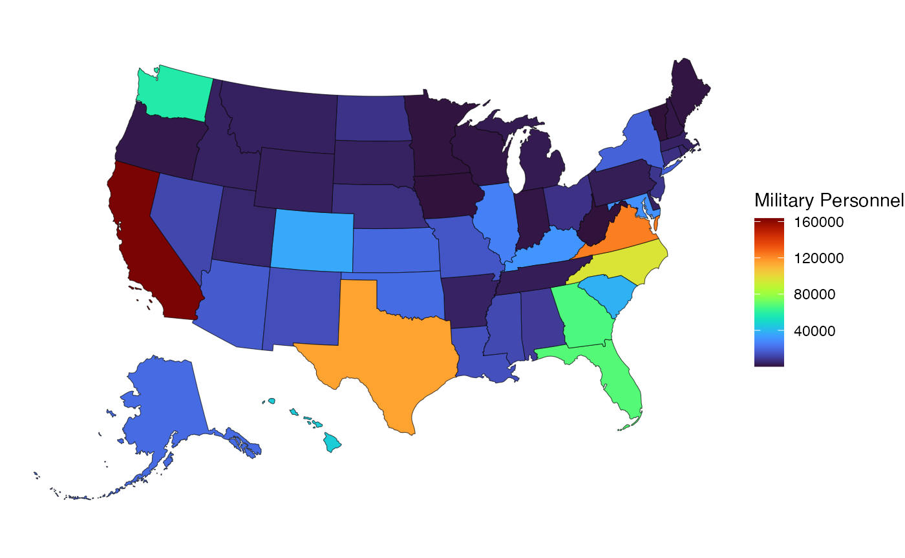

# get_troopdata

This page provides an overview for the
[`get_troopdata()`](https://meflynn.github.io/troopdata/reference/get_troopdata.md)
function, highlighting some of its potential uses.

First things first—let’s load the
[troopdata](https://github.com/meflynn/troopdata) package

``` r
library(troopdata)
library(ggplot2)
#> Warning: package 'ggplot2' was built under R version 4.4.3
library(tidyverse)
#> Warning: package 'tibble' was built under R version 4.4.3
#> Warning: package 'tidyr' was built under R version 4.4.3
#> Warning: package 'purrr' was built under R version 4.4.3
#> Warning: package 'dplyr' was built under R version 4.4.3
#> ── Attaching core tidyverse packages ──────────────────────── tidyverse 2.0.0 ──
#> ✔ dplyr     1.2.0     ✔ readr     2.1.5
#> ✔ forcats   1.0.1     ✔ stringr   1.6.0
#> ✔ lubridate 1.9.4     ✔ tibble    3.3.1
#> ✔ purrr     1.2.1     ✔ tidyr     1.3.2
#> ── Conflicts ────────────────────────────────────────── tidyverse_conflicts() ──
#> ✖ dplyr::filter() masks stats::filter()
#> ✖ dplyr::lag()    masks stats::lag()
#> ℹ Use the conflicted package (<http://conflicted.r-lib.org/>) to force all conflicts to become errors
library(viridis)
#> Loading required package: viridisLite
```

The `troopdata` package provides multiple functions to generate
customizable datasets containing information on US military deployments
and accompanying data. The
[`get_troopdata()`](https://meflynn.github.io/troopdata/reference/get_troopdata.md)
function represents the core of this package, providing customized data
on US overseas troop deployments, specifically.

## Country-year data

The first function of this package is the
[`get_troopdata()`](https://meflynn.github.io/troopdata/reference/get_troopdata.md)
function. At its most basic this function returns a data frame of
country-year troop deployment values for the selected time period, using
the `startdate` and `enddate` parameters.

    #> # A tibble: 6 × 6
    #>   iso3c  year ccode countryname   region        troops_ad
    #>   <chr> <dbl> <dbl> <chr>         <chr>             <dbl>
    #> 1 USA    1990     2 United States North America   1138627
    #> 2 USA    1991     2 United States North America   1216348
    #> 3 USA    1992     2 United States North America   1171208
    #> 4 USA    1993     2 United States North America   1127242
    #> 5 USA    1994     2 United States North America   1073309
    #> 6 USA    1995     2 United States North America   1041320

For users who want more refined data, the there are a number of
arguments that allow the user to further tailor the output to their
needs.

The `host` argument allows users to specify the set of host countries
for which they would like data returned. This can be a vector of
numerical values equal to a Correlates of War (COW) Project country
code, a vector of character values equal to an ISO3C country code, or a
vector of character values corresponding to full country names. Note
that when supplying a vector of values they must be consistent and
correspond to a single type of identifier at a time (i.e. they must all
be numeric COW codes, ISO3C character codes, country names, or region
names).

For example, you can use a numeric vector of COW country codes like
this:

``` r

# Let's make the host selection more specific
hostlist <- c(200, 220)

example <- get_troopdata(host = hostlist, startyear = 1990, endyear = 2020)
#> Warning in get_troopdata(host = hostlist, startyear = 1990, endyear = 2020):
#> total_ad value shows the total number of active duty personnel only and does
#> not include any guard or reserve troops that may be present. For the total
#> number of uniformed personnel please choose guard_reserve = TRUE. Note that
#> guard and reserve data are not included in DMDC reports prior to 2008 so
#> troops_all should be equal to troops_ad for earlier time periods.

head(example)
#> # A tibble: 6 × 6
#>   ccode  year iso3c countryname    region                troops_ad
#>   <dbl> <dbl> <chr> <chr>          <chr>                     <dbl>
#> 1   200  1990 GBR   United Kingdom Europe & Central Asia     25111
#> 2   200  1991 GBR   United Kingdom Europe & Central Asia     23442
#> 3   200  1992 GBR   United Kingdom Europe & Central Asia     20048
#> 4   200  1993 GBR   United Kingdom Europe & Central Asia     16100
#> 5   200  1994 GBR   United Kingdom Europe & Central Asia     13781
#> 6   200  1995 GBR   United Kingdom Europe & Central Asia     12131
```

Or you can use a character vector of ISO3C codes.

``` r

hostlist.char <- c("CAN", "GBR")

example.char <- get_troopdata(host = hostlist.char, startyear = 1970, endyear = 2020)
#> Warning in get_troopdata(host = hostlist.char, startyear = 1970, endyear =
#> 2020): total_ad value shows the total number of active duty personnel only and
#> does not include any guard or reserve troops that may be present. For the total
#> number of uniformed personnel please choose guard_reserve = TRUE. Note that
#> guard and reserve data are not included in DMDC reports prior to 2008 so
#> troops_all should be equal to troops_ad for earlier time periods.

head(example.char)
#> # A tibble: 6 × 6
#>   iso3c  year ccode countryname region        troops_ad
#>   <chr> <dbl> <dbl> <chr>       <chr>             <dbl>
#> 1 CAN    1970    20 Canada      North America      2643
#> 2 CAN    1971    20 Canada      North America      1835
#> 3 CAN    1972    20 Canada      North America      1742
#> 4 CAN    1973    20 Canada      North America      1362
#> 5 CAN    1974    20 Canada      North America      1690
#> 6 CAN    1975    20 Canada      North America      2607
```

Similarly, we can search for full country names:

``` r
hostlist.names <- c("Canada", "United Kingdom")

example.names <- get_troopdata(host = hostlist.names, startyear = 1970, endyear = 2020)
#> Warning in get_troopdata(host = hostlist.names, startyear = 1970, endyear =
#> 2020): total_ad value shows the total number of active duty personnel only and
#> does not include any guard or reserve troops that may be present. For the total
#> number of uniformed personnel please choose guard_reserve = TRUE. Note that
#> guard and reserve data are not included in DMDC reports prior to 2008 so
#> troops_all should be equal to troops_ad for earlier time periods.

head(example.names)
#> # A tibble: 6 × 6
#>   countryname  year ccode iso3c region        troops_ad
#>   <chr>       <dbl> <dbl> <chr> <chr>             <dbl>
#> 1 Canada       1970    20 CAN   North America      2643
#> 2 Canada       1971    20 CAN   North America      1835
#> 3 Canada       1972    20 CAN   North America      1742
#> 4 Canada       1973    20 CAN   North America      1362
#> 5 Canada       1974    20 CAN   North America      1690
#> 6 Canada       1975    20 CAN   North America      2607
```

When searching for country names, the function will do its best to
identify the correct country based on the character string that’s
included. This can include cases where fragments of country names are
included and the function will try to return the correct country.

``` r

example.frag <- get_troopdata(host = "South Ko", startyear = 1970, endyear = 2020)
#> Warning in get_troopdata(host = "South Ko", startyear = 1970, endyear = 2020):
#> total_ad value shows the total number of active duty personnel only and does
#> not include any guard or reserve troops that may be present. For the total
#> number of uniformed personnel please choose guard_reserve = TRUE. Note that
#> guard and reserve data are not included in DMDC reports prior to 2008 so
#> troops_all should be equal to troops_ad for earlier time periods.

head(example.frag)
#> # A tibble: 6 × 6
#>   countryname  year ccode iso3c region              troops_ad
#>   <chr>       <dbl> <dbl> <chr> <chr>                   <dbl>
#> 1 South Korea  1970   732 KOR   East Asia & Pacific    104566
#> 2 South Korea  1971   732 KOR   East Asia & Pacific     81480
#> 3 South Korea  1972   732 KOR   East Asia & Pacific     83200
#> 4 South Korea  1973   732 KOR   East Asia & Pacific     83728
#> 5 South Korea  1974   732 KOR   East Asia & Pacific     81756
#> 6 South Korea  1975   732 KOR   East Asia & Pacific     82372
```

Finally, we can also search by region. Instead of inserting a country
name or code into the host argument you can simply include character
strings that represent regions. In these cases the function returns the
aggregate sum of all deployments within that region for the specified
time period

``` r

region.list <- c("Europe", "Asia")

example.region <- get_troopdata(host = region.list, startyear = 1970, endyear = 2020)
#> Warning in get_troopdata(host = region.list, startyear = 1970, endyear = 2020):
#> total_ad value shows the total number of active duty personnel only and does
#> not include any guard or reserve troops that may be present. For the total
#> number of uniformed personnel please choose guard_reserve = TRUE. Note that
#> guard and reserve data are not included in DMDC reports prior to 2008 so
#> troops_all should be equal to troops_ad for earlier time periods.

head(example.region)
#> # A tibble: 6 × 3
#>   region               year troops_ad
#>   <chr>               <dbl>     <dbl>
#> 1 East Asia & Pacific  1970    821756
#> 2 East Asia & Pacific  1971    446050
#> 3 East Asia & Pacific  1972    138484
#> 4 East Asia & Pacific  1973     83728
#> 5 East Asia & Pacific  1974     81756
#> 6 East Asia & Pacific  1975     82372
```

## Disaggregated Data

By default the
[`get_troopdata()`](https://meflynn.github.io/troopdata/reference/get_troopdata.md)
function returns the aggregate sum of active duty military personnel.
But the original DMDC reports often include disaggregated figures, with
separate counts for each branch of the military. The `branch` argument
allows users to specify whether they would like to receive the aggregate
sum of all branches or the disaggregated figures for each branch. This
argument can take on three values: `TRUE`, `FALSE`, or a vector of
branch names.

``` r

# Let's get the disaggregated data for the US deployments to Canada and the UK
hostlist <- c("Canada", "United Kingdom")

example.branch <- get_troopdata(host = hostlist, branch = TRUE, startyear = 1970, endyear = 2020)
#> Warning: Branch data only includes active duty by default. This preserves
#> continuity across time periods as guard and reserve data are not reported prior
#> to 2008 Also note that disaggregated data are not available for 2003 and 2004
#> as the DMDC did not issue reports for those years. Also note that Iraq does not
#> have branch data for 2003-2007 and troops_ad value is estimated using
#> alternative sources.
#> Warning in get_troopdata(host = hostlist, branch = TRUE, startyear = 1970, :
#> total_ad value shows the total number of active duty personnel only and does
#> not include any guard or reserve troops that may be present. For the total
#> number of uniformed personnel please choose guard_reserve = TRUE. Note that
#> guard and reserve data are not included in DMDC reports prior to 2008 so
#> troops_all should be equal to troops_ad for earlier time periods.
#> Warning: There were 204 warnings in `dplyr::summarise()`.
#> The first warning was:
#> ℹ In argument: `dplyr::across(...)`.
#> ℹ In group 1: `countryname = "Canada"`, `year = 1970`.
#> Caused by warning in `max()`:
#> ! no non-missing arguments to max; returning -Inf
#> ℹ Run `dplyr::last_dplyr_warnings()` to see the 203 remaining warnings.

head(example.branch)
#> # A tibble: 6 × 12
#>   countryname  year ccode iso3c region    troops_ad army_ad navy_ad air_force_ad
#>   <chr>       <dbl> <dbl> <chr> <chr>         <dbl>   <dbl>   <dbl>        <dbl>
#> 1 Canada       1970    20 CAN   North Am…      2643      12     413         2218
#> 2 Canada       1971    20 CAN   North Am…      1835      12     433         1381
#> 3 Canada       1972    20 CAN   North Am…      1742      14     410         1315
#> 4 Canada       1973    20 CAN   North Am…      1362      12     390          951
#> 5 Canada       1974    20 CAN   North Am…      1690      11     703          969
#> 6 Canada       1975    20 CAN   North Am…      2607      11    1839          757
#> # ℹ 3 more variables: marine_corps_ad <dbl>, coast_guard_ad <lgl>,
#> #   space_force_ad <lgl>
```

In each case the `_ad` suffix on the variable name indicates “Active
Duty” numbers for the given branch.

Note that the total does not necessarily equal the sum of the individual
branches. The function returns the maximum annual value for each branch.
In cases where there are quarterly values reported, the sum total may
come from one quarter and the individual branch values may come from
another quarter.

We can also include disaggregated data national guard and reserve
personnel, as well as DoD civilians. These numbers are generally only
reported for more recent years, and are not available for all countries
and time periods. Later updates will include more observations for
earlier time periods where they are available.

``` r

hostlist <- c("Canada", "United Kingdom")

example.branch <- get_troopdata(host = hostlist, branch = TRUE, startyear = 1970, endyear = 2020, guard_reserve = TRUE, civilians = TRUE)
#> Warning: Branch data only includes active duty by default. This preserves
#> continuity across time periods as guard and reserve data are not reported prior
#> to 2008 Also note that disaggregated data are not available for 2003 and 2004
#> as the DMDC did not issue reports for those years. Also note that Iraq does not
#> have branch data for 2003-2007 and troops_ad value is estimated using
#> alternative sources.
#> Warning: Guard and Reserve data only available for 2008 forward. Values will
#> display as NA for earlier time periods.
#> Warning: There were 918 warnings in `dplyr::summarise()`.
#> The first warning was:
#> ℹ In argument: `dplyr::across(...)`.
#> ℹ In group 1: `countryname = "Canada"`, `year = 1970`.
#> Caused by warning in `max()`:
#> ! no non-missing arguments to max; returning -Inf
#> ℹ Run `dplyr::last_dplyr_warnings()` to see the 917 remaining warnings.

head(example.branch)
#> # A tibble: 6 × 27
#>   countryname  year ccode iso3c region    troops_ad army_ad navy_ad air_force_ad
#>   <chr>       <dbl> <dbl> <chr> <chr>         <dbl>   <dbl>   <dbl>        <dbl>
#> 1 Canada       1970    20 CAN   North Am…      2643      12     413         2218
#> 2 Canada       1971    20 CAN   North Am…      1835      12     433         1381
#> 3 Canada       1972    20 CAN   North Am…      1742      14     410         1315
#> 4 Canada       1973    20 CAN   North Am…      1362      12     390          951
#> 5 Canada       1974    20 CAN   North Am…      1690      11     703          969
#> 6 Canada       1975    20 CAN   North Am…      2607      11    1839          757
#> # ℹ 18 more variables: marine_corps_ad <dbl>, coast_guard_ad <lgl>,
#> #   space_force_ad <lgl>, army_national_guard <lgl>, air_national_guard <lgl>,
#> #   army_reserve <lgl>, navy_reserve <lgl>, marine_corps_reserve <lgl>,
#> #   air_force_reserve <lgl>, coast_guard_reserve <lgl>,
#> #   total_selected_reserve <dbl>, troops_all <dbl>, army_civilian <dbl>,
#> #   navy_civilian <dbl>, marine_corps_civilian <dbl>, air_force_civilian <dbl>,
#> #   dod_civilian <dbl>, total_civilian <dbl>
```

## Time Periods

The most recent update also allows users to specify more fine grained
temporal coverage. DMDC reports have historically been released on an
annual basis, but in more recent years they have been released twice
annually or even quarterly, and the
[`get_troopdata()`](https://meflynn.github.io/troopdata/reference/get_troopdata.md)
function allows users to specify whether they would like to receive the
quarterly data or the annual data. The `quarters` argument allows users
to specify whether they would like to receive the quarterly data or the
annual data. This argument can take on two values: `TRUE` or `FALSE`
with the default being `FALSE`.

If the user opts to return quarterly data, the function will return the
month and quarter columns in addition to the year. Note that not every
quarter corresponds to a quarterly report for every country. In some
cases the quarterly value may be a 0 rather than `NA`. Additionally, the
Army has not reported branch data for several recent quarters between
2022 and 2023 due to internal personnel management changes. Accordingly
the aggregate totals for these quarters may be lower than expected or
not available.

Here we use full country names. See! Neat!

``` r

# Let's get the quarterly data for the US deployments to Canada and the UK
hostlist <- c("Canada", "United Kingdom")

example.quarters <- get_troopdata(host = hostlist, branch = TRUE, startyear = 2015, endyear = 2022, quarters = TRUE)
#> Warning: Branch data only includes active duty by default. This preserves
#> continuity across time periods as guard and reserve data are not reported prior
#> to 2008 Also note that disaggregated data are not available for 2003 and 2004
#> as the DMDC did not issue reports for those years. Also note that Iraq does not
#> have branch data for 2003-2007 and troops_ad value is estimated using
#> alternative sources.
#> Warning: Some service branches do not report data for all quarters. See the
#> following note from December, 2022, June 2023, and March 2023 DMDC reports:
#> 'The Army is converting its Integrated Personnel and Pay System (IPPS-A) and so
#> the Army did not provide military personnel data for end-of-June 2023.' We use
#> a stepwise imputation process to fill in the gaps between September 2022 and
#> September 2023, taking the difference between the values for these two periods
#> and incrementally adjusting totals for the missing periods between.
#> Warning in get_troopdata(host = hostlist, branch = TRUE, startyear = 2015, :
#> total_ad value shows the total number of active duty personnel only and does
#> not include any guard or reserve troops that may be present. For the total
#> number of uniformed personnel please choose guard_reserve = TRUE. Note that
#> guard and reserve data are not included in DMDC reports prior to 2008 so
#> troops_all should be equal to troops_ad for earlier time periods.
#> Warning: There were 130 warnings in `dplyr::summarise()`.
#> The first warning was:
#> ℹ In argument: `dplyr::across(...)`.
#> ℹ In group 29: `countryname = "Canada"`, `year = 2022`, `month = "December"`,
#>   `quarter = 4`.
#> Caused by warning in `max()`:
#> ! no non-missing arguments to max; returning -Inf
#> ℹ Run `dplyr::last_dplyr_warnings()` to see the 129 remaining warnings.

head(example.quarters)
#> # A tibble: 6 × 14
#>   countryname  year month   quarter ccode iso3c region troops_ad army_ad navy_ad
#>   <chr>       <dbl> <chr>     <dbl> <dbl> <chr> <chr>      <dbl>   <dbl>   <dbl>
#> 1 Canada       2015 Decemb…       4    20 CAN   North…        91       3       0
#> 2 Canada       2015 June          2    20 CAN   North…       295       8       0
#> 3 Canada       2015 March         1    20 CAN   North…       144       8       0
#> 4 Canada       2015 Septem…       3    20 CAN   North…       146       8       0
#> 5 Canada       2016 Decemb…       4    20 CAN   North…       141       6       0
#> 6 Canada       2016 June          2    20 CAN   North…       281       6       0
#> # ℹ 4 more variables: air_force_ad <dbl>, marine_corps_ad <dbl>,
#> #   coast_guard_ad <lgl>, space_force_ad <lgl>
```

## Data for US States

The package now incorporates data on the number of US service personnel
in each US state. The functionality of the command works just as it does
when users are looking to pull data for countries, with a couple of
small changes.

First, these data come from the DMDC reports beginning in 2008, so we
don’t have as much time to work with as we do with the country-level
data.

Second, users need to make sure they set `state_data = TRUE` in the
function call. The data for US states work with different identifiers,
so this argument needs to be set for the function to differentiate
between queries looking at country data and queries looking at data on
US states.

Finally, as mentioned above, the data for US states use different
identifiers for the relevant geographic units. Users can search for data
by the state’s name using character strings, just like in the
country-level data. Users can also look to match US states by their
numeric FIPS codes. These are useful if we’re interested in generating
things like maps using the state-level data.

``` r
library(usmap)
library(ggplot2)

states <- get_troopdata(startyear = 2025, state_data = TRUE)
#> Warning in get_troopdata(startyear = 2025, state_data = TRUE): total_ad value
#> shows the total number of active duty personnel only and does not include any
#> guard or reserve troops that may be present. For the total number of uniformed
#> personnel please choose guard_reserve = TRUE. Note that guard and reserve data
#> are not included in DMDC reports prior to 2008 so troops_all should be equal to
#> troops_ad for earlier time periods.

map.data <- usmap::us_map(regions = "states") %>% 
  dplyr::mutate(fips = as.numeric(fips)) %>% 
  left_join(states, by = c("fips" = "fipscode"))

ggplot2::ggplot(data = map.data) +
  geom_sf(aes(geometry = geom, fill = troops_ad)) +
  theme_void() +
  viridis::scale_fill_viridis(option = "turbo") +
  labs(fill = "Military Personnel")
```



## Reports

Finally, users may want to view the original DMDC reports that the data
is drawn from. The `reports` argument allows users to specify whether
they would like to receive the original DMDC reports that the data is
drawn from. This argument can take on two values: `TRUE` or `FALSE` with
the default being `FALSE`.

Users can specify the `host`, `startyear`, and `endyear` arguments as
they would for the main function. The function will return data frame
single data frame containing all of the original columns found in the
DMDC reports upon which the data are based. The formatting and column
names will be roughly consistent with the original reports, but the data
will be filtered to only include the specified host countries and time
period.

The `source` column in the data frame provides the month and the year
that the data was drawn from. This allows the user to more easily track
down the original DMDC report that the data was drawn from. The current
and archived reports can be found here: [DMDC
Reports](https://dwp.dmdc.osd.mil/dwp/app/dod-data-reports/workforce-reports)

Also note that if `reports` is set to `TRUE` then the user must also set
the `quarters` argument to `TRUE`.
