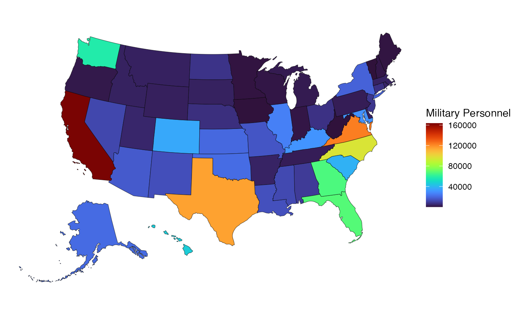

# get_troopdata

This page provides an overview for the
[`get_troopdata()`](https://meflynn.github.io/troopdata/reference/get_troopdata.md)
function, highlighting some of its potential uses.

First things first—let’s load the
[troopdata](https://github.com/meflynn/troopdata) package

``` r

library(troopdata)
library(ggplot2)
library(tidyverse)
#> ── Attaching core tidyverse packages ──────────────────────── tidyverse 2.0.0 ──
#> ✔ dplyr     1.2.1     ✔ readr     2.2.0
#> ✔ forcats   1.0.1     ✔ stringr   1.6.0
#> ✔ lubridate 1.9.5     ✔ tibble    3.3.1
#> ✔ purrr     1.2.2     ✔ tidyr     1.3.2
#> ── Conflicts ────────────────────────────────────────── tidyverse_conflicts() ──
#> ✖ dplyr::filter() masks stats::filter()
#> ✖ dplyr::lag()    masks stats::lag()
#> ℹ Use the conflicted package (<http://conflicted.r-lib.org/>) to force all conflicts to become errors
library(viridis)
#> Loading required package: viridisLite
```

The `troopdata` package provides multiple functions to generate
customizable datasets containing information on US military deployments
and accompanying data. The
[`get_troopdata()`](https://meflynn.github.io/troopdata/reference/get_troopdata.md)
function represents the core of this package, providing customized data
on US overseas troop deployments, specifically.

## Country-year data

The first function of this package is the
[`get_troopdata()`](https://meflynn.github.io/troopdata/reference/get_troopdata.md)
function. At its most basic this function returns a data frame of
country-year troop deployment values for the selected time period, using
the `startyear` and `endyear` parameters. Here are the values for the
United States from 1990 to 2020.

    #> # A tibble: 6 × 6
    #>   iso3c  year ccode countryname   region        troops_ad
    #>   <chr> <dbl> <dbl> <chr>         <chr>             <dbl>
    #> 1 USA    1990     2 United States North America   1202031
    #> 2 USA    1991     2 United States North America   1283014
    #> 3 USA    1992     2 United States North America   1238280
    #> 4 USA    1993     2 United States North America   1192215
    #> 5 USA    1994     2 United States North America   1134519
    #> 6 USA    1995     2 United States North America   1096501

For users who want more refined data, the there are a number of
arguments that allow the user to further tailor the output to their
needs.

The `host` argument allows users to specify the set of host countries
for which they would like data returned. If you leave it out you get
every location in the data, the United States included. This can be a
vector of numerical values equal to a Gleditsch and Ward country code, a
vector of character values equal to an ISO3C country code, or a vector
of character values corresponding to full country names. Note that when
supplying a vector of values they must be consistent and correspond to a
single type of identifier at a time (i.e. they must all be numeric
country codes, ISO3C character codes, country names, or region names).
If one of the values does not match anything, the function returns the
rest and gives a warning that names the value it could not match.

A note on the numeric codes: the data use the Gleditsch and Ward list,
not the Correlates of War list. The two agree for most countries, but
not all of them. Germany, for example, is 260 here and not 255.
Territories and other locations that the Gleditsch and Ward list does
not cover have codes of our own, such as 6 for Puerto Rico, 1002 for
Greenland and 1008 for Guam. A numeric code that is not in the data
returns an error rather than an empty data frame.

For example, you can use a numeric vector of country codes like this:

``` r


# Let's make the host selection more specific
hostlist <- c(200, 220)

example <- get_troopdata(host = hostlist, startyear = 1990, endyear = 2020)
#> Warning in get_troopdata(host = hostlist, startyear = 1990, endyear = 2020):
#> total_ad value shows the total number of active duty personnel only and does
#> not include any guard or reserve troops that may be present. For the total
#> number of uniformed personnel please choose guard_reserve = TRUE. Note that
#> guard and reserve data are not included in DMDC reports prior to 2008 so
#> troops_all should be equal to troops_ad for earlier time periods.

head(example)
#> # A tibble: 6 × 6
#>   ccode  year iso3c countryname    region                troops_ad
#>   <dbl> <dbl> <chr> <chr>          <chr>                     <dbl>
#> 1   200  1990 GBR   United Kingdom Europe & Central Asia     25111
#> 2   200  1991 GBR   United Kingdom Europe & Central Asia     23442
#> 3   200  1992 GBR   United Kingdom Europe & Central Asia     20048
#> 4   200  1993 GBR   United Kingdom Europe & Central Asia     16100
#> 5   200  1994 GBR   United Kingdom Europe & Central Asia     13781
#> 6   200  1995 GBR   United Kingdom Europe & Central Asia     12131
```

Or you can use a character vector of ISO3C codes.

``` r


hostlist.char <- c("CAN", "GBR")

example.char <- get_troopdata(host = hostlist.char, startyear = 1970, endyear = 2020)
#> Warning in get_troopdata(host = hostlist.char, startyear = 1970, endyear =
#> 2020): total_ad value shows the total number of active duty personnel only and
#> does not include any guard or reserve troops that may be present. For the total
#> number of uniformed personnel please choose guard_reserve = TRUE. Note that
#> guard and reserve data are not included in DMDC reports prior to 2008 so
#> troops_all should be equal to troops_ad for earlier time periods.
#> Warning: Filtering `host` on ISO3C codes cannot reach every location in the
#> data. 3 observations across 1 countries and territories carry no ISO3C code, so
#> they are excluded from any ISO3C filter no matter which codes you ask for --
#> together 168 reported personnel between 1970 and 2020. The largest in this
#> window: Spratly Islands (168). To include them, pass `host` as a country name
#> or a Gleditsch and Ward country code, or leave `host` unset and subset
#> afterwards.
#> Warning: One or more of the requested ISO3C codes covers more than one country
#> code, because a sub-national unit with no ISO3C of its own carries its
#> parent's: GBR = Akrotiri, United Kingdom. These are returned as separate rows,
#> so aggregate across `ccode` rather than assuming one row per ISO3C and period.

head(example.char)
#> # A tibble: 6 × 6
#>   iso3c  year ccode countryname region        troops_ad
#>   <chr> <dbl> <dbl> <chr>       <chr>             <dbl>
#> 1 CAN    1970    20 Canada      North America      2643
#> 2 CAN    1971    20 Canada      North America      1835
#> 3 CAN    1972    20 Canada      North America      1742
#> 4 CAN    1973    20 Canada      North America      1362
#> 5 CAN    1974    20 Canada      North America      1580
#> 6 CAN    1975    20 Canada      North America      1301
```

A few locations have no ISO3C code of their own and carry their
parent’s, so one code can return more than one location. `"GBR"` returns
the United Kingdom and Akrotiri, `"PRT"` returns Portugal and the
Azores, and `"UMI"` returns Wake, Midway and Johnston Islands. Each
location comes back on its own row with its own country code, and a
warning tells you when this happens. Add the rows up if you want a
single figure for the ISO3C code.

Similarly, we can search for full country names:

``` r

hostlist.names <- c("Canada", "United Kingdom")

example.names <- get_troopdata(host = hostlist.names, startyear = 1970, endyear = 2020)
#> Warning in get_troopdata(host = hostlist.names, startyear = 1970, endyear =
#> 2020): total_ad value shows the total number of active duty personnel only and
#> does not include any guard or reserve troops that may be present. For the total
#> number of uniformed personnel please choose guard_reserve = TRUE. Note that
#> guard and reserve data are not included in DMDC reports prior to 2008 so
#> troops_all should be equal to troops_ad for earlier time periods.
#> Warning: `host` matched more than one country code: Canada (20), United Kingdom
#> (200). These are returned as separate rows, so aggregate across `ccode` if you
#> want one series for the country as a whole.

head(example.names)
#> # A tibble: 6 × 6
#>   countryname  year ccode iso3c region        troops_ad
#>   <chr>       <dbl> <dbl> <chr> <chr>             <dbl>
#> 1 Canada       1970    20 CAN   North America      2643
#> 2 Canada       1971    20 CAN   North America      1835
#> 3 Canada       1972    20 CAN   North America      1742
#> 4 Canada       1973    20 CAN   North America      1362
#> 5 Canada       1974    20 CAN   North America      1580
#> 6 Canada       1975    20 CAN   North America      1301
```

When searching for country names, the function will do its best to
identify the correct country based on the character string that’s
included. This can include cases where fragments of country names are
included and the function will try to return the correct country.

``` r


example.frag <- get_troopdata(host = "South Ko", startyear = 1970, endyear = 2020)
#> Warning in get_troopdata(host = "South Ko", startyear = 1970, endyear = 2020):
#> total_ad value shows the total number of active duty personnel only and does
#> not include any guard or reserve troops that may be present. For the total
#> number of uniformed personnel please choose guard_reserve = TRUE. Note that
#> guard and reserve data are not included in DMDC reports prior to 2008 so
#> troops_all should be equal to troops_ad for earlier time periods.

head(example.frag)
#> # A tibble: 6 × 6
#>   countryname  year ccode iso3c region              troops_ad
#>   <chr>       <dbl> <dbl> <chr> <chr>                   <dbl>
#> 1 South Korea  1970   732 KOR   East Asia & Pacific     52197
#> 2 South Korea  1971   732 KOR   East Asia & Pacific     40740
#> 3 South Korea  1972   732 KOR   East Asia & Pacific     41600
#> 4 South Korea  1973   732 KOR   East Asia & Pacific     41864
#> 5 South Korea  1974   732 KOR   East Asia & Pacific     40387
#> 6 South Korea  1975   732 KOR   East Asia & Pacific     40204
```

Finally, we can also search by region. Instead of inserting a country
name or code into the host argument you can simply include character
strings that represent regions. In these cases the function returns
every country in the matching region or regions for the specified time
period, one row per country and year, with the region in its own column.
Nothing is added up across the countries of a region.

The regions are East Asia & Pacific, Europe & Central Asia, Latin
America & Caribbean, Middle East & North Africa, North America, South
Asia and Sub-Saharan Africa. (Antarctica and the “Afloat” location are
in regions of their own.) Region names are matched as fragments, which
calls for a little care:

- A fragment that matches one region works fine. `"Europe"` returns
  Europe & Central Asia.
- A fragment that matches several regions returns all of them, with a
  warning. `"Asia"` returns the countries of East Asia & Pacific, South
  Asia, and Europe & Central Asia.
- A fragment that is also part of a country name is read as a country,
  again with a warning. `"Africa"` returns South Africa and the Central
  African Republic, so ask for `"Sub-Saharan Africa"` instead.
- Regions and country names cannot be mixed in one call.

``` r


region.list <- c("Europe & Central Asia", "East Asia & Pacific")

example.region <- get_troopdata(host = region.list, startyear = 1970, endyear = 2020)
#> Warning in get_troopdata(host = region.list, startyear = 1970, endyear = 2020):
#> total_ad value shows the total number of active duty personnel only and does
#> not include any guard or reserve troops that may be present. For the total
#> number of uniformed personnel please choose guard_reserve = TRUE. Note that
#> guard and reserve data are not included in DMDC reports prior to 2008 so
#> troops_all should be equal to troops_ad for earlier time periods.

head(example.region)
#> # A tibble: 6 × 6
#>   countryname  year ccode iso3c region                troops_ad
#>   <chr>       <dbl> <dbl> <chr> <chr>                     <dbl>
#> 1 Abkhazia     2008   396 GEO   Europe & Central Asia         0
#> 2 Abkhazia     2009   396 GEO   Europe & Central Asia         0
#> 3 Abkhazia     2010   396 GEO   Europe & Central Asia         0
#> 4 Abkhazia     2011   396 GEO   Europe & Central Asia         0
#> 5 Abkhazia     2012   396 GEO   Europe & Central Asia         0
#> 6 Abkhazia     2013   396 GEO   Europe & Central Asia         0
```

## Disaggregated Data

By default the
[`get_troopdata()`](https://meflynn.github.io/troopdata/reference/get_troopdata.md)
function returns the aggregate sum of active duty military personnel.
But the original DMDC reports often include disaggregated figures, with
separate counts for each branch of the military. The `branch` argument
allows users to specify whether they would like to receive the aggregate
sum of all branches or the disaggregated figures for each branch. This
argument can take on two values: `TRUE` or `FALSE`, with the default
being `FALSE`.

``` r


# Let's get the disaggregated data for the US deployments to Canada and the UK
hostlist <- c("Canada", "United Kingdom")

example.branch <- get_troopdata(host = hostlist, branch = TRUE, startyear = 1970, endyear = 2020)
#> Warning: Branch data only includes active duty by default. This preserves
#> continuity across time periods as guard and reserve data are not reported prior
#> to 2008. Also note that Iraq does not have branch data for 2003-2007 and
#> troops_ad value is estimated using alternative sources.
#> Warning in get_troopdata(host = hostlist, branch = TRUE, startyear = 1970, :
#> total_ad value shows the total number of active duty personnel only and does
#> not include any guard or reserve troops that may be present. For the total
#> number of uniformed personnel please choose guard_reserve = TRUE. Note that
#> guard and reserve data are not included in DMDC reports prior to 2008 so
#> troops_all should be equal to troops_ad for earlier time periods.
#> Warning: `host` matched more than one country code: Canada (20), United Kingdom
#> (200). These are returned as separate rows, so aggregate across `ccode` if you
#> want one series for the country as a whole.

head(example.branch)
#> # A tibble: 6 × 12
#>   countryname  year ccode iso3c region    troops_ad army_ad navy_ad air_force_ad
#>   <chr>       <dbl> <dbl> <chr> <chr>         <dbl>   <dbl>   <dbl>        <dbl>
#> 1 Canada       1970    20 CAN   North Am…      2643      12     413         2218
#> 2 Canada       1971    20 CAN   North Am…      1835      12     433         1381
#> 3 Canada       1972    20 CAN   North Am…      1742      14     410         1315
#> 4 Canada       1973    20 CAN   North Am…      1362      12     390          951
#> 5 Canada       1974    20 CAN   North Am…      1580      11     593          969
#> 6 Canada       1975    20 CAN   North Am…      1301      11     533          757
#> # ℹ 3 more variables: marine_corps_ad <dbl>, coast_guard_ad <dbl>,
#> #   space_force_ad <dbl>
```

In each case the `_ad` suffix on the variable name indicates “Active
Duty” numbers for the given branch.

Note that the total does not necessarily equal the sum of the individual
branches. The function returns the maximum annual value for each branch.
In cases where there are quarterly values reported, the sum total may
come from one quarter and the individual branch values may come from
another quarter. The section on time periods below shows an example.

We can also include disaggregated data national guard and reserve
personnel, as well as DoD civilians. The reports give these numbers from
2008 forward, so they show up as `NA` for earlier years. Setting
`guard_reserve = TRUE` also returns `troops_all`, which is the active
duty total plus the guard and reserve columns. Before 2008 it is the
same as `troops_ad`.

``` r


hostlist <- c("Canada", "United Kingdom")

example.branch <- get_troopdata(host = hostlist, branch = TRUE, startyear = 1970, endyear = 2020, guard_reserve = TRUE, civilians = TRUE)
#> Warning: Branch data only includes active duty by default. This preserves
#> continuity across time periods as guard and reserve data are not reported prior
#> to 2008. Also note that Iraq does not have branch data for 2003-2007 and
#> troops_ad value is estimated using alternative sources.
#> Warning: Guard and Reserve data only available for 2008 forward. Values will
#> display as NA for earlier time periods.
#> Warning: `host` matched more than one country code: Canada (20), United Kingdom
#> (200). These are returned as separate rows, so aggregate across `ccode` if you
#> want one series for the country as a whole.

head(example.branch)
#> # A tibble: 6 × 27
#>   countryname  year ccode iso3c region    troops_ad army_ad navy_ad air_force_ad
#>   <chr>       <dbl> <dbl> <chr> <chr>         <dbl>   <dbl>   <dbl>        <dbl>
#> 1 Canada       1970    20 CAN   North Am…      2643      12     413         2218
#> 2 Canada       1971    20 CAN   North Am…      1835      12     433         1381
#> 3 Canada       1972    20 CAN   North Am…      1742      14     410         1315
#> 4 Canada       1973    20 CAN   North Am…      1362      12     390          951
#> 5 Canada       1974    20 CAN   North Am…      1580      11     593          969
#> 6 Canada       1975    20 CAN   North Am…      1301      11     533          757
#> # ℹ 18 more variables: marine_corps_ad <dbl>, coast_guard_ad <dbl>,
#> #   space_force_ad <dbl>, army_national_guard <dbl>, air_national_guard <dbl>,
#> #   army_reserve <dbl>, navy_reserve <dbl>, marine_corps_reserve <dbl>,
#> #   air_force_reserve <dbl>, coast_guard_reserve <dbl>,
#> #   total_selected_reserve <dbl>, troops_all <dbl>, army_civilian <dbl>,
#> #   navy_civilian <dbl>, marine_corps_civilian <dbl>, air_force_civilian <dbl>,
#> #   dod_civilian <dbl>, total_civilian <dbl>
```

## Time Periods

The most recent update also allows users to specify more fine grained
temporal coverage. DMDC reports have historically been released on an
annual basis, but in more recent years they have been released twice
annually or even quarterly, and the
[`get_troopdata()`](https://meflynn.github.io/troopdata/reference/get_troopdata.md)
function allows users to specify whether they would like to receive the
quarterly data or the annual data. The `quarters` argument allows users
to specify whether they would like to receive the quarterly data or the
annual data. This argument can take on two values: `TRUE` or `FALSE`
with the default being `FALSE`.

The data have one report per year through 2012, two for 2013 (September
and December), and four per year from 2014 forward (March, June,
September and December). The most recent year only has the reports that
have been published so far.

If the user opts to return quarterly data, the function will return the
month and quarter columns in addition to the year, and each row holds
the figures from that one report. A country that a report does not list
gets a 0 for that period rather than `NA`, so a zero can mean either
that the report shows zero or that the country is not in it. Territories
such as Guam or Bermuda are different: they only have a row for the
periods in which a report lists them.

Here we use full country names. See! Neat!

``` r


# Let's get the quarterly data for the US deployments to Canada and the UK
hostlist <- c("Canada", "United Kingdom")

example.quarters <- get_troopdata(host = hostlist, branch = TRUE, startyear = 2015, endyear = 2022, quarters = TRUE)
#> Warning: Branch data only includes active duty by default. This preserves
#> continuity across time periods as guard and reserve data are not reported prior
#> to 2008. Also note that Iraq does not have branch data for 2003-2007 and
#> troops_ad value is estimated using alternative sources.
#> Warning: Some service branches do not report data for all quarters. See the
#> following note from December, 2022, June 2023, and March 2023 DMDC reports:
#> 'The Army is converting its Integrated Personnel and Pay System (IPPS-A) and so
#> the Army did not provide military personnel data for end-of-June 2023.' We use
#> a stepwise imputation process to fill in the Army values between September 2022
#> and September 2023, taking the difference between the values for these two
#> periods and incrementally adjusting the Army figures for the missing periods
#> between. The other services reported for those quarters and their values are
#> shown as reported; totals are the sum of the two.
#> Warning in get_troopdata(host = hostlist, branch = TRUE, startyear = 2015, :
#> total_ad value shows the total number of active duty personnel only and does
#> not include any guard or reserve troops that may be present. For the total
#> number of uniformed personnel please choose guard_reserve = TRUE. Note that
#> guard and reserve data are not included in DMDC reports prior to 2008 so
#> troops_all should be equal to troops_ad for earlier time periods.
#> Warning: `host` matched more than one country code: Canada (20), United Kingdom
#> (200). These are returned as separate rows, so aggregate across `ccode` if you
#> want one series for the country as a whole.

head(example.quarters)
#> # A tibble: 6 × 14
#>   countryname  year month   quarter ccode iso3c region troops_ad army_ad navy_ad
#>   <chr>       <dbl> <chr>     <dbl> <dbl> <chr> <chr>      <dbl>   <dbl>   <dbl>
#> 1 Canada       2015 Decemb…       4    20 CAN   North…        91       3       1
#> 2 Canada       2015 June          2    20 CAN   North…       153       8      43
#> 3 Canada       2015 March         1    20 CAN   North…       144       8      38
#> 4 Canada       2015 Septem…       3    20 CAN   North…       146       8      42
#> 5 Canada       2016 Decemb…       4    20 CAN   North…       141       6      38
#> 6 Canada       2016 June          2    20 CAN   North…       146       6      41
#> # ℹ 4 more variables: air_force_ad <dbl>, marine_corps_ad <dbl>,
#> #   coast_guard_ad <dbl>, space_force_ad <dbl>
```

### How the annual values are chosen

When a year has more than one report, the annual data return the
**highest value reported in that year**. This is not an average, and it
is not the value from one particular month. It is also done separately
for each column, so the total can come from one report and a branch
figure from another.

Japan in 2019 is a good example. Here are the four quarterly reports:

``` r


japan.quarters <- get_troopdata(host = "Japan", branch = TRUE, startyear = 2019, endyear = 2019, quarters = TRUE)

# Put the rows in calendar order and keep the columns we want to compare
japan.quarters <- japan.quarters[order(japan.quarters$quarter), ]

japan.quarters[, c("countryname", "year", "month", "troops_ad", "army_ad", "navy_ad", "air_force_ad", "marine_corps_ad")]
#> # A tibble: 4 × 8
#>   countryname  year month troops_ad army_ad navy_ad air_force_ad marine_corps_ad
#>   <chr>       <dbl> <chr>     <dbl>   <dbl>   <dbl>        <dbl>           <dbl>
#> 1 Japan        2019 March     56134    2657   20846        12140           20475
#> 2 Japan        2019 June      55327    2671   20845        12447           19348
#> 3 Japan        2019 Sept…     55245    2626   20392        12602           19607
#> 4 Japan        2019 Dece…     57094    2516   20733        12757           21070
```

And here is the annual row for the same year:

``` r


japan.annual <- get_troopdata(host = "Japan", branch = TRUE, startyear = 2019, endyear = 2019)

japan.annual[, c("countryname", "year", "troops_ad", "army_ad", "navy_ad", "air_force_ad", "marine_corps_ad")]
#> # A tibble: 1 × 7
#>   countryname  year troops_ad army_ad navy_ad air_force_ad marine_corps_ad
#>   <chr>       <dbl>     <dbl>   <dbl>   <dbl>        <dbl>           <dbl>
#> 1 Japan        2019     57094    2671   20846        12757           21070
```

The annual `troops_ad` value is the December figure, the largest of the
four. But the annual `army_ad` value is the June figure and the annual
`navy_ad` value is the March figure, because those were the largest for
each of those branches. This is why the branch columns in the annual
data do not have to add up to `troops_ad`. If you need figures that all
come from the same report, use `quarters = TRUE`.

Before 2013 there is only one report per year, so the annual value is
the value from that report, or the outside figure described below where
the report has none.

### Gaps in the reports

A few values do not come straight from a report. The big ones are:

- **1951 and 1952.** There are no reports for these years. For countries
  the totals move in equal steps between the 1950 and 1953 figures, and
  there are no branch figures. Most territories have no rows for these
  two years.
- **December 2022, March 2023 and June 2023.** The Army did not report
  any personnel figures for these quarters while it switched to a new
  personnel system. In the country data the Army figures for these
  quarters move in equal steps between the September 2022 and September
  2023 reports, and the totals are those figures plus what the other
  services reported. The data for US states and the reports themselves
  are left as published, so the Army figures and the totals are `NA`
  there.
- **June 2023.** The June 2023 report has its civilian columns and some
  of its guard and reserve columns printed one row too low for part of
  the overseas list, so that Qatar’s row shows Puerto Rico’s numbers.
  The country data put these figures back on the right rows. The reports
  themselves (`reports = TRUE`) are left as published.
- **Afghanistan, Iraq, Kuwait and Syria.** The reports do not give the
  number of personnel deployed to these countries for much of the 2000s,
  and from December 2017 they leave out deployed personnel in
  Afghanistan, Iraq and Syria again. Where we could, we use figures from
  Kane’s data or from public reporting instead (Afghanistan 2001-2005
  and 2018-2020, Iraq 2003-2007 and 2018-2021, Kuwait 2003-2007, and
  Syria 2018-2021). These are totals only, so the branch columns are
  zero. After those years the values are whatever the reports show,
  which is only a handful of people and well below the actual US
  presence. For Iraq in 2018-2021 and Syria in 2021 the outside figure
  only appears in the June row of the quarterly data, so use the annual
  data for those.

The [Rebuild
Notes](https://meflynn.github.io/troopdata/articles/01-rebuild-notes-vignette.html)
article and the help page for
[`get_troopdata()`](https://meflynn.github.io/troopdata/reference/get_troopdata.md)
go through all of this in more detail.

## Personnel Afloat

The reports for 1950 through 2007 count personnel ashore and personnel
afloat separately, and for some years they assign the afloat personnel
to a country, usually the country of the nearest port. By default the
country figures only include personnel ashore. The `afloat` argument
lets you change that:

- `afloat = "exclude"` is the default. Country figures are personnel
  ashore only.
- `afloat = "include"` adds the afloat personnel assigned to a country
  to that country’s totals.
- `afloat = "separate"` keeps the ashore figures as they are and returns
  the afloat personnel next to them in the `troops_afloat`,
  `navy_afloat` and `marine_corps_afloat` columns.

``` r


greece <- get_troopdata(host = "Greece", startyear = 1958, endyear = 1962, afloat = "separate")

greece[, c("countryname", "year", "troops_ad", "troops_afloat", "navy_ad", "navy_afloat")]
#> # A tibble: 5 × 6
#>   countryname  year troops_ad troops_afloat navy_ad navy_afloat
#>   <chr>       <dbl>     <dbl>         <dbl>   <dbl>       <dbl>
#> 1 Greece       1958      1575          7018      41        6910
#> 2 Greece       1959      1592          6721      39        6389
#> 3 Greece       1960      1976         13090     308       13090
#> 4 Greece       1961      1937          5383      33        5383
#> 5 Greece       1962      2576          6186     339        6186
```

There were about 2,000 personnel ashore in Greece in 1960, and more than
13,000 afloat who were counted there because that is where the fleet was
on the day of the count.

Everyone afloat is also carried in a separate location named “Afloat”
(country code 10200). It is not a country, so remember to leave it out
if you are adding up countries. From September 2008 the reports count a
ship’s crew at its home port, as part of the country or state figure, so
the argument makes no difference for 2008 and later.

## Data for US States

The package now incorporates data on the number of US service personnel
in each US state. The functionality of the command works just as it does
when users are looking to pull data for countries, with a couple of
small changes.

First, these data come from the DMDC reports beginning in 2008, so we
don’t have as much time to work with as we do with the country-level
data. They cover the fifty states and the District of Columbia. Puerto
Rico, Guam and the other territories are in the country-level data.

Second, users need to make sure they set `state_data = TRUE` in the
function call. The data for US states work with different identifiers,
so this argument needs to be set for the function to differentiate
between queries looking at country data and queries looking at data on
US states.

Finally, as mentioned above, the data for US states use different
identifiers for the relevant geographic units. Users can search for data
by the state’s name using character strings, just like in the
country-level data. Capitalization does not matter. A full state name
returns just that state, so `"kansas"` gives you Kansas and `"Virginia"`
does not also give you West Virginia, while part of a name such as
`"Carolina"` returns every state that contains it. Users can also look
to match US states by their numeric FIPS codes. These are useful if
we’re interested in generating things like maps using the state-level
data.

The `branch`, `guard_reserve`, `civilians` and `quarters` arguments work
the same way they do for countries, and annual values are again the
highest value reported in the year. Two things to keep in mind. The Army
did not report for December 2022, March 2023 and June 2023, and the
state data leave the Army figures and the totals as `NA` for those
quarters rather than filling them in, so the annual Army figures and
totals for 2022 and 2023 come from the other quarters. And from December
2015 to December 2017 the reports list a large number of Navy personnel
in no state at all, so the Navy figures for home-port states like
Virginia and California are lower in those quarters.

``` r

library(usmap)
library(ggplot2)

states <- get_troopdata(startyear = 2025, endyear = 2025, state_data = TRUE)
#> Warning in get_troopdata(startyear = 2025, endyear = 2025, state_data = TRUE):
#> total_ad value shows the total number of active duty personnel only and does
#> not include any guard or reserve troops that may be present. For the total
#> number of uniformed personnel please choose guard_reserve = TRUE. Note that
#> guard and reserve data are not included in DMDC reports prior to 2008 so
#> troops_all should be equal to troops_ad for earlier time periods.

map.data <- usmap::us_map(regions = "states") %>% 
  dplyr::mutate(fips = as.numeric(fips)) %>% 
  left_join(states, by = c("fips" = "fipscode"))

ggplot2::ggplot(data = map.data) +
  geom_sf(aes(geometry = geom, fill = troops_ad)) +
  theme_void() +
  viridis::scale_fill_viridis(option = "turbo") +
  labs(fill = "Military Personnel")
```



## Reports

Finally, users may want to view the original DMDC reports that the data
is drawn from. The `reports` argument allows users to specify whether
they would like to receive the original DMDC reports that the data is
drawn from. This argument can take on two values: `TRUE` or `FALSE` with
the default being `FALSE`.

Users can specify the `host`, `startyear`, and `endyear` arguments as
they would for the main function. The function will return a single data
frame containing all of the original columns found in the DMDC reports
upon which the data are based. The formatting and column names will be
roughly consistent with the original reports, but the data will be
filtered to only include the specified host countries and time period.

The reports are returned row by row, as they were published, with
nothing added up. This means a country code can show up on more than one
row in the same period when a report lists parts of a country
separately. Japan and the Ryukyu Islands (Okinawa), for example, are
separate lines in the reports through 1973 and both come back when you
ask for Japan. The country-level data add those rows together.

The `source` column in the data frame provides the month and the year
that the data was drawn from. This allows the user to more easily track
down the original DMDC report that the data was drawn from. The current
and archived reports can be found here: [DMDC
Reports](https://dwp.dmdc.osd.mil/dwp/app/dod-data-reports/workforce-reports)

Also note that if `reports` is set to `TRUE` then the user must also set
the `quarters` argument to `TRUE`.
