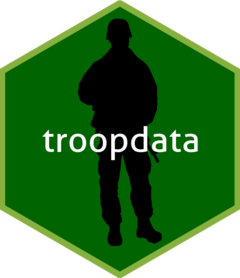

# `troopdata`: Tools for Analyzing Cross-National Military Deployment and Basing Data



The goal of the [troopdata](https://github.com/meflynn/troopdata)
package is to facilitate the distribution of military deployment and
basing data for use in social science research and journalism. The troop
deployment data were initially compiled by Tim Kane using information
obtained from the U.S. Department of Defense’s Defense Manpower Data
Center (DMDC). The original data ended in 2005 and we have updated it to
run through March 2026.

Similarly, the basing data were initially compiled by David Vine, and we
have updated the original data using open source information from the
U.S. military and press reports through 2018. We have also assembled
this R package to allow users to more easily access the data and use it
in their own research.

The package will be updated with additional features in the future, but
for now please let me know if you find any errors.

Please refer to the bottom of this page for citation information.

You can also find more information on the package and changes
corresponding to each update here:
<https://meflynn.github.io/troopdata/index.html>

## Installation

You can install the `troopdata` package from CRAN or
[GitHub](https://github.com/) with:

``` r

#install.packages("devtools")

install.packages("troopdata")

or 

devtools::install_github("meflynn/troopdata")
```

## Use

This package currently has four functions:

[`get_troopdata()`](https://meflynn.github.io/troopdata/reference/get_troopdata.md):
Returns a data frame containing U.S. military deployment values.
Depending on the arguments specified the function returns total troop
deployments, or total deployments plus service branch-specific
deployment values, guard and reserve values, and DoD civilian values.
Users can specify select countries and years, or call the entire data
frame. Annual values are the highest value reported in a given year.
Quarterly values and data for individual US states are also available.

[`get_basedata()`](https://meflynn.github.io/troopdata/reference/get_basedata.md):
Returns a data frame containing information on U.S. military bases
around the globe from the Cold War forward. Depending on the arguments
specified the function will return the entire data set or data for a
particular country. Observations can be site-specific or can be
aggregated to generate country counts.

[`get_builddata()`](https://meflynn.github.io/troopdata/reference/get_builddata.md):
Returns a data frame containing geocoded location-project-year
information on U.S. military construction spending, in the United States
and overseas. Users can specify select countries and years, or call the
entire data frame. The data cover fiscal years 2000 through 2026.

[`get_exercises()`](https://meflynn.github.io/troopdata/reference/get_exercises.md):
Returns a long format data frame containing data on military exercises.
These data were originally compiled by Vito D’Orazio and Kevin Galambos.

## Examples

You can find more detailed vignettes on these functions below:

1.  [`get_troopdata`](https://meflynn.github.io/troopdata/articles/troopdata-vignette.html)
2.  [`get_basedata`](https://meflynn.github.io/troopdata/articles/basedata-vignette.html)
3.  [`get_builddata`](https://meflynn.github.io/troopdata/articles/builddata-vignette.html)
4.  [`get_exercises`](https://meflynn.github.io/troopdata/articles/exercise-vignette.html)

The [Rebuild
Notes](https://meflynn.github.io/troopdata/articles/01-rebuild-notes-vignette.html)
explain how the troop deployment values are put together, including how
annual values are chosen, what zeros and missing values mean, and which
values are estimates.

## A note on country codes

The original DMDC data contain information on U.S. troop deployments to
a wide range of locations, including several non-state territories and
subnational units (e.g. Okinawa). The troop deployment and construction
data use Gleditsch and Ward country codes as the primary host ID
variable. That list has no codes for most territories, so we assign our
own. Puerto Rico is 6, Greenland is 1002 and Guam is 1008, for example,
which lets users distinguish cases where deployments are present in a
territory versus the metropole. Note that these are not Correlates of
War (COW) codes. Germany, for example, is 260 rather than 255. The Vine
basing data have not been rebuilt yet and still use COW codes, and there
some smaller territories have the code of the power that controls them.
Using the ISO country codes provides some additional flexibility when
calling the data. Worst case, you can pull the full data frame and look
around at the specific observations and figure out what best suits your
needs.

## How to cite this package and data?

When using the updated troop deployment data and/or the `troopdata`
package please cite the following:

- Michael A. Allen, Michael E. Flynn, and Carla Martinez Machain. 2022.
  “Global U.S. military deployment data: 1950-2020.” Conflict Management
  and Peace Science. 39(3): 351-370.

Kane’s original troop deployment data collected from 1950-2005:

- Kane, Tim. 2005. “Global U.S. troop deployment, 1950-2003.” Technical
  Report. Heritage Foundation, Washington, D.C.

Vine’s original basing data:

- Vine, David. 2015. “Base nation: How U.S. military bases abroad harm
  America and the World.” Metropolitan Books, Washington, D.C.

Construction data

- Michael A. Allen, Michael E. Flynn, and Carla Martinez Machain. 2020.
  “Outside the wire: US military deployments and public opinion in host
  states.” American Political Science Review. 114(2): 326-341.

Military exercise data:

- D’Orazio, Vito; Galambos, Kevin, 2021, “Multinational Military
  Exercises, 1980-2010”, <https://doi.org/10.7910/DVN/KHFODX>, Harvard
  Dataverse, V1.
