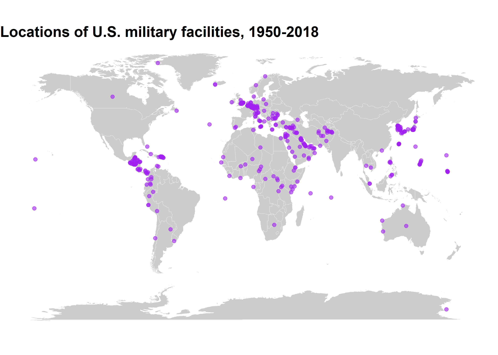

<!-- README.md is generated from README.Rmd. Please edit that file -->

# `troopdata`: Tools for Analyzing Cross-National Military Deployment and Basing Data

<!-- badges: start -->

[](https://cran.r-project.org/package=troopdata)
[](https://github.com/meflynn/troopdata)
[](https://cran.r-project.org/package=troopdata)
[](https://cran.r-project.org/package=troopdata)
[](https://cran.r-project.org/package=troopdata)
<!-- badges: end -->


The goal of the `{troopdata}` package is to facilitate the distribution
of military deployment and basing data for use in social science
research and journalism. The troop deployment data were initially
compiled by Tim Kane using information obtained from the U.S. Department
of Defense’s Defense Manpower Data Center (DMDC). The original data
ended in 2005 and we have updated it to run through 2020. Similarly, the
basing data were initially compiled by David Vine, and we have updated
the original data using open source information from the U.S. military
and press reports through 2018. We have also assembled this R package to
allow users to more easily access the data and use it in their own
research.

The package will be updated with additional features in the future, but
for now please let me know if you find any errors.

Please refer to the bottom of this page for citation information.

## Installation

You can install the `troopdata` package from CRAN or
[GitHub](https://github.com/) with:

``` r
#install.packages("devtools")

install.packages("troopdata")

or 

devtools::install_github("meflynn/troopdata")
```

## Use

This package currently has two functions:

`get_troopdata()`: Returns a data frame containing country-year U.S.
military deployment values. Depending on the arguments specified, either
total troop deployments, or total deployments plus service
branch-specific deployment values, are returned.

`get_basedata()`: Returns a data frame containing information on U.S.
military bases around the globe from the Cold War forward. Depending on
the arguments specified the function will return the entire data set or
data for a particular country. Observations can be site-specific or can
be aggregated to generate country counts.

## Example

### `get_troopdata`

The first function of this package is the `get_troopdata()` function. At
its most basic this function returns a data frame of country-year troop
deployment values for the selected time period, using the `startdate`
and `enddate` parameters.

For users who want more refined data, the `host` argument and the
`branch` arguments allow users to specify the set of host countries for
which they would like data returned. This must be a single numerical
value equal to a Correlates of War (COW) Project country code, a single
character value equal to an ISO3C country code, or a vector of similar
values. Note they must be consistent (i.e. they must all be numeric COW
codes or ISO3C character codes).

For example, you can use a numeric vector of COW country codes:

``` r
# Let's make the host selection more specific
hostlist <- c(200, 220)

example <- get_troopdata(host = hostlist, startyear = 1990, endyear = 2020)
#> Warning in if (is.na(host)) {: the condition has length > 1 and only the first
#> element will be used

head(example)
#> # A tibble: 6 x 5
#>   countryname    ccode iso3c  year troops
#>   <chr>          <dbl> <chr> <dbl>  <dbl>
#> 1 United Kingdom   200 GBR    1990  25111
#> 2 United Kingdom   200 GBR    1991  23442
#> 3 United Kingdom   200 GBR    1992  20048
#> 4 United Kingdom   200 GBR    1993  16100
#> 5 United Kingdom   200 GBR    1994  13781
#> 6 United Kingdom   200 GBR    1995  12131
```

Or you can use a character vector of ISO3C codes.

``` r
hostlist.char <- c("CAN", "GBR")

example.char <- get_troopdata(host = hostlist.char, startyear = 1970, endyear = 2020)
#> Warning in if (is.na(host)) {: the condition has length > 1 and only the first
#> element will be used

head(example.char)
#> # A tibble: 6 x 5
#>   countryname ccode iso3c  year troops
#>   <chr>       <dbl> <chr> <dbl>  <dbl>
#> 1 Canada         20 CAN    1970   2643
#> 2 Canada         20 CAN    1971   1835
#> 3 Canada         20 CAN    1972   1742
#> 4 Canada         20 CAN    1973   1362
#> 5 Canada         20 CAN    1974   1580
#> 6 Canada         20 CAN    1975   1301
```

``` r
hostlist <- c(20, 200, 220)

example <- get_troopdata(host = hostlist, branch = TRUE, startyear = 2006, endyear = 2020)
#> Warning: Branch data only available for 2006 forward.
#> Warning in if (is.na(host)) {: the condition has length > 1 and only the first
#> element will be used

head(example)
#> # A tibble: 6 x 9
#>   countryname ccode iso3c  year troops  army  navy air_force marine_corps
#>   <chr>       <dbl> <chr> <dbl>  <dbl> <dbl> <dbl>     <dbl>        <dbl>
#> 1 Canada         20 CAN    2006    133     7    35        81           10
#> 2 Canada         20 CAN    2007    141     7    41        84            9
#> 3 Canada         20 CAN    2008     92     8     0        82            2
#> 4 Canada         20 CAN    2009     91     8     0        83            0
#> 5 Canada         20 CAN    2010    129     3    28        98            0
#> 6 Canada         20 CAN    2011    128     7    38        83            0
```

### `get_basedata`

The second function, `get_basedata()` returns a data frame containing
information on the United States’ overseas military bases going back to
the beginning of the Cold War. At its most basic the function will
return a data frame containing country-base observations, along with the
facility’s longitude and latitude (if available), and a series of binary
variables indicating whether or not the facility is a full military
base, a smaller lilypad, and if it is a currently funded site.

``` r
baseexample <- get_basedata(host = NA, country_count = FALSE)

head(baseexample)
#> # A tibble: 6 x 9
#>   countryname ccode iso3c basename            lat   lon  base lilypad fundedsite
#>   <chr>       <dbl> <chr> <chr>             <dbl> <dbl> <dbl>   <dbl>      <dbl>
#> 1 Afghanistan   700 AFG   Bagram AB          34.9  69.3     1       0          0
#> 2 Afghanistan   700 AFG   Kandahar Airfield  31.5  65.8     1       0          0
#> 3 Afghanistan   700 AFG   Mazar-e-Sharif     36.7  67.2     1       0          0
#> 4 Afghanistan   700 AFG   Gardez             33.6  69.2     1       0          0
#> 5 Afghanistan   700 AFG   Kabul              34.5  69.2     1       0          0
#> 6 Afghanistan   700 AFG   Herat              34.3  62.2     1       0          0
```

As with the `get_troopdata()` function you can specify a numeric vector
of COW country codes or a character vector of ISO3C codes to specify
specific host countries.

For example, using COW country codes:

``` r
hostlist <- c(20, 200, 255, 645)

baseexample <- get_basedata(host = hostlist, country_count = FALSE)
#> Warning in if (!is.numeric(host) & !is.character(host) & !is.na(host)) {: the
#> condition has length > 1 and only the first element will be used
#> Warning in if (is.na(host)) {: the condition has length > 1 and only the first
#> element will be used

head(baseexample)
#> # A tibble: 6 x 9
#>   countryname     ccode iso3c basename       lat    lon  base lilypad fundedsite
#>   <chr>           <dbl> <chr> <chr>        <dbl>  <dbl> <dbl>   <dbl>      <dbl>
#> 1 Ascension Isla~   200 GBR   Ascension I~ -7.95  -14.4     1       0          0
#> 2 BR Indian Ocea~   200 GBR   Diego Garcia -7.32   72.4     1       0          0
#> 3 Canada             20 CAN   <NA>         56.1  -106.      0       1          0
#> 4 Canada             20 CAN   Argentia, N~ 47.3   -54.0     1       0          0
#> 5 Germany           255 DEU   Amberg       49.4    11.9     1       0          0
#> 6 Germany           255 DEU   USAG Ansbach 49.3    10.6     1       0          0
```

And another using ISO3C codes:

``` r
hostlist.char <- c("CAN", "GBR", "PRI")

baseexample <- get_basedata(host = hostlist.char, country_count = FALSE)
#> Warning in if (!is.numeric(host) & !is.character(host) & !is.na(host)) {: the
#> condition has length > 1 and only the first element will be used
#> Warning in if (is.na(host)) {: the condition has length > 1 and only the first
#> element will be used
```

Finally, users can also generate country-level counts of the number of
U.S. military bases by changing the `country_count` argument to `TRUE`.

``` r
hostlist <- c(20, 200, 255, 645)

baseexample <- get_basedata(host = hostlist, country_count = TRUE)
#> Warning in if (!is.numeric(host) & !is.character(host) & !is.na(host)) {: the
#> condition has length > 1 and only the first element will be used
#> Warning in if (is.na(host)) {: the condition has length > 1 and only the first
#> element will be used

head(baseexample)
#> # A tibble: 6 x 9
#>   countryname     ccode iso3c basename       lat    lon  base lilypad fundedsite
#>   <chr>           <dbl> <chr> <chr>        <dbl>  <dbl> <dbl>   <dbl>      <dbl>
#> 1 Ascension Isla~   200 GBR   Ascension I~ -7.95  -14.4     1       0          0
#> 2 BR Indian Ocea~   200 GBR   Diego Garcia -7.32   72.4     1       0          0
#> 3 Canada             20 CAN   <NA>         56.1  -106.      0       1          0
#> 4 Canada             20 CAN   Argentia, N~ 47.3   -54.0     1       0          0
#> 5 Germany           255 DEU   Amberg       49.4    11.9     1       0          0
#> 6 Germany           255 DEU   USAG Ansbach 49.3    10.6     1       0          0
```

## Applications

So what can you do with these super useful and cool data? Lots of
things! The study of basing and military deployments has been picking up
over the last few years and there are lots of cool studies you should
check out. With these data you can do cool things like this!

``` r
library(ggplot2)

map <- ggplot2::map_data("world")
basepoints <- get_basedata(host = NA)


basemap <- ggplot() +
  geom_polygon(data = map, aes(x = long, y = lat, group = group), fill = "gray80", color = "white", size = 0.1) +
  geom_point(data = basepoints, aes(x = lon, y = lat), color = "purple", alpha = 0.6) +
  coord_equal(ratio = 1.3) +
  theme_void() +
  theme(plot.title = element_markdown(face = "bold", size = 15)) +
  labs(title = "Locations of U.S. military facilities, 1950-2018")


basemap
```



## A note on country codes

The original DMDC data contain information on U.S. troop deployments to
a a wide range of locations, including several non-state territories.
One downside of using the COW country codes as the primary host ID
variable is that there are often no country codes for smaller states and
territories. In the case of the Vine basing data, some smaller
territories have COW codes for the imperial power that controls a
territory. For example, Puerto Rico and Guam both receive a COW country
code of 2 as they are territorial possessions of the United States.
Users may want to distinguish such cases where deployments are present
in a territory versus the metropole. Using the ISO country codes
provides some additional flexibility when calling the data. Worst case,
you can pull the full data frame and look around at the specific
observations and figure out what best suits your needs.

## How to cite this package and data?

When using the updated troop deployment data and/or the `troopdata`
package please cite the following:

-   Allen, Michael A., Michael E. Flynn, and Carla Martinez
    Machain. 2021. “Global U.S. military deployment data: 1950-2020.”
    *Working Paper*

Kane’s original troop deployment data collected from 1950-2005:

-   Kane, Tim. 2005. “Global U.S. troop deployment, 1950-2003.”
    Technical Report. Heritage Foundation, Washington, D.C.

Vine’s original basing data:

-   Vine, David. 2015. “Base nation: How U.S. military bases abroad harm
    America and the World.” Metropolitan Books, Washington, D.C.
